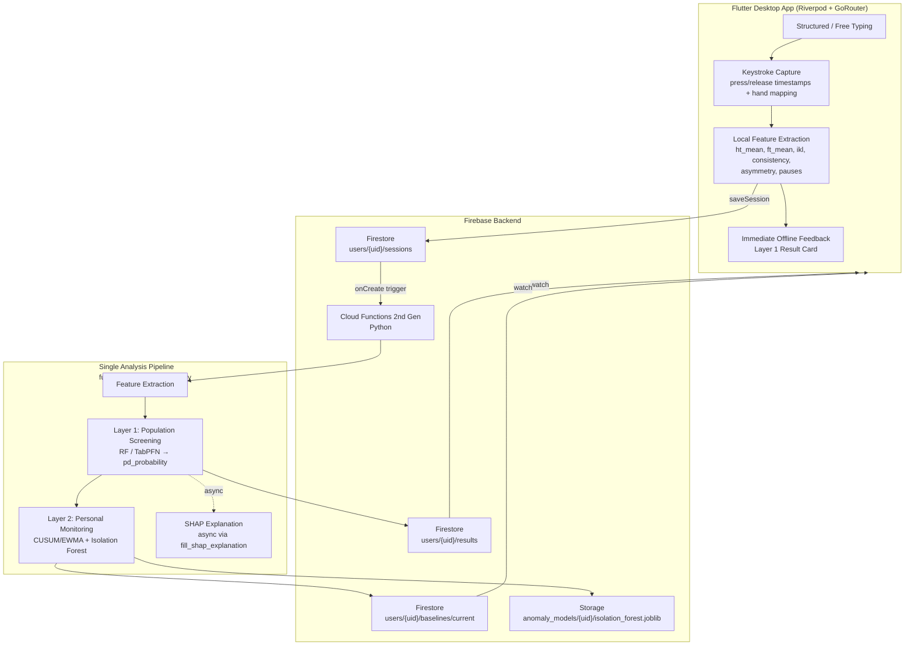
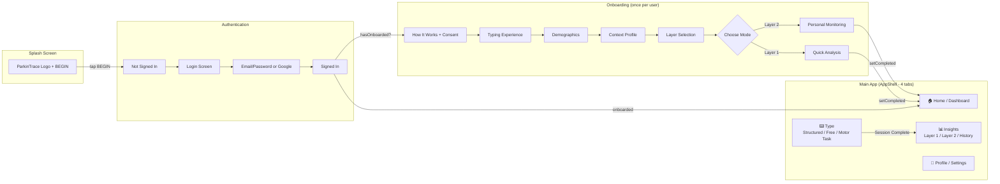
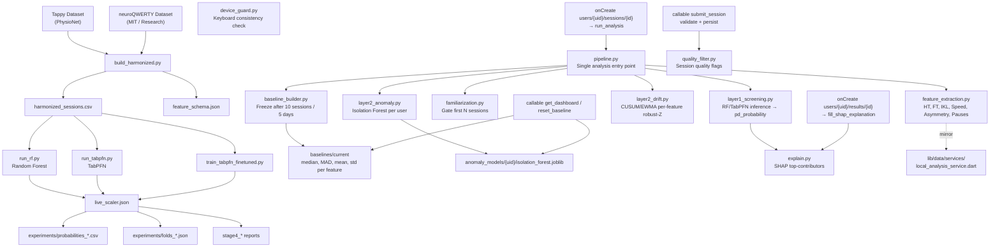
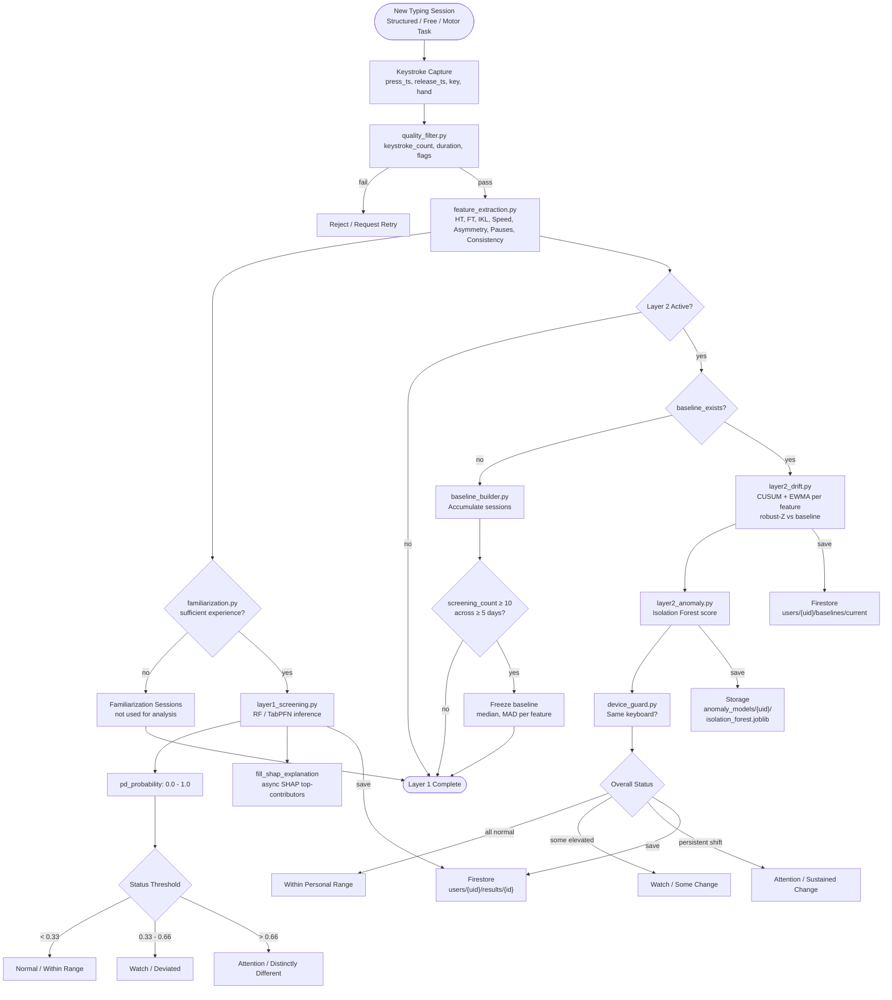
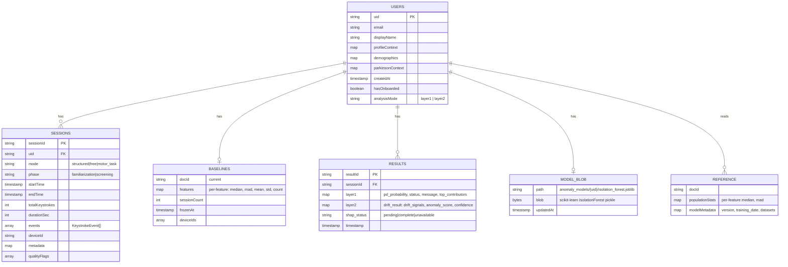
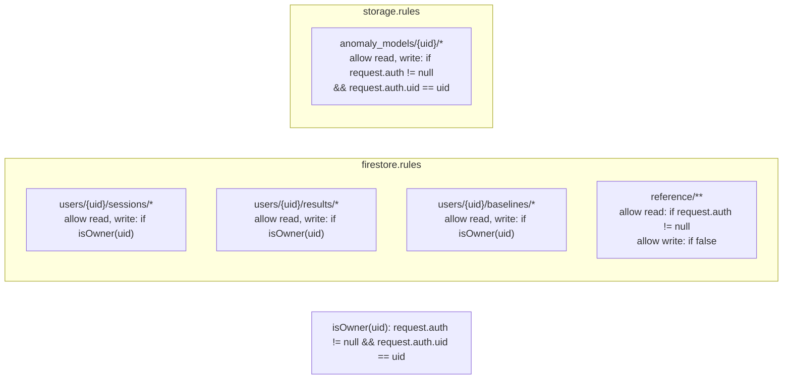
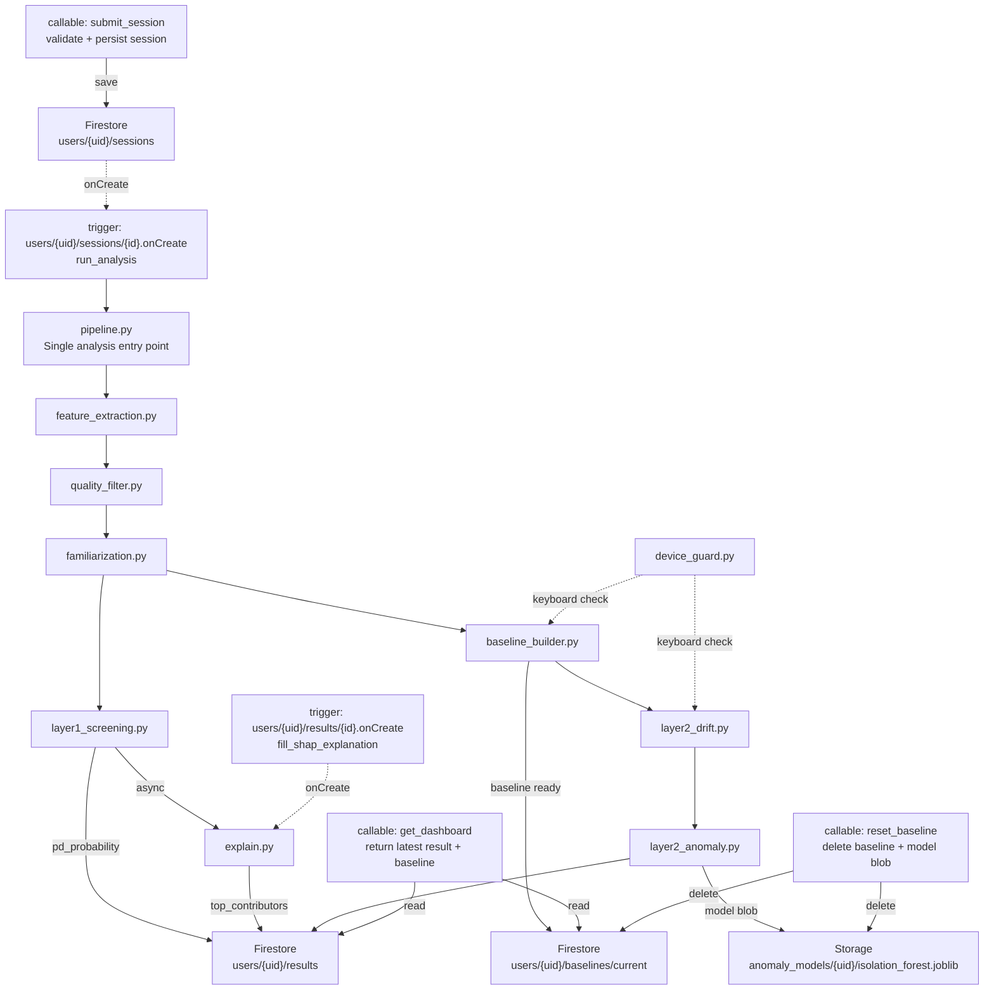
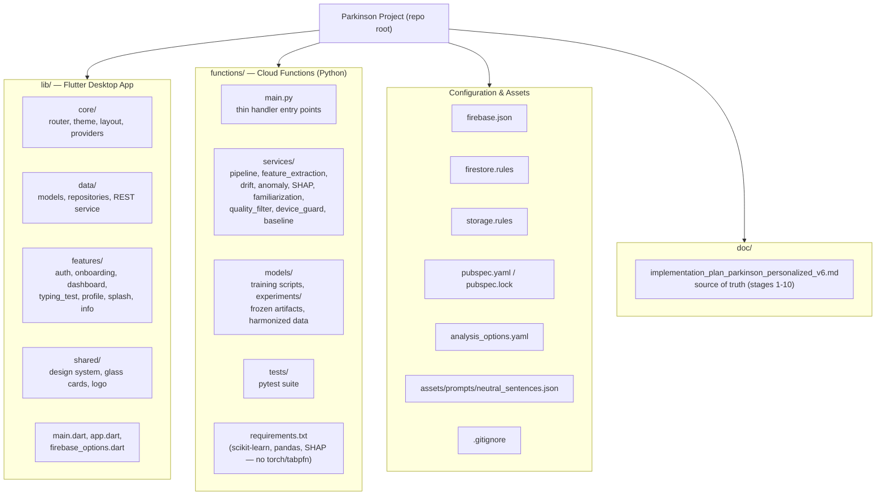

# ParkinTrace — Keystroke-Dynamics Based Parkinson's Screening & Longitudinal Monitoring System

> **Academic Research Project** — Submitted in partial fulfillment of degree requirements.  
> This repository is maintained for academic evaluation and demonstration purposes. It is **not** an open-source product and is **not licensed for public distribution or commercial use**.

---

## Abstract

**ParkinTrace** is a desktop application for research-oriented screening and longitudinal monitoring of Parkinson's-related motor signatures through passive keystroke dynamics. The system analyses typing timing — hold time, flight time, inter-key latency, and consistency — **never the typed content** — to identify (a) population-level deviations and (b) personalized drift over time.

The project implements a **two-layer architecture**: **Layer 1** performs population comparison using models trained on harmonized public research datasets (Tappy & neuroQWERTY); **Layer 2** builds a personal baseline and applies statistical drift detection (CUSUM/EWMA) and anomaly detection (Isolation Forest) to track changes across sessions. All outputs are framed as *research signals* — the system does not provide a medical diagnosis and always recommends clinician follow-up for unusual patterns.

---

## 1. Research Objectives

1.  Investigate keystroke timing as a low-burden, passive signal for Parkinson's-related motor monitoring.
2.  Harmonize heterogeneous public datasets into a unified feature space for cross-dataset evaluation.
3.  Evaluate classical (Random Forest) and tabular foundation (TabPFN) models for population-level screening.
4.  Design a personalized longitudinal monitoring pipeline that adapts to an individual's typing baseline.
5.  Deliver a privacy-preserving desktop application with secure, owner-scoped data storage and reproducible evaluation.

---

## 2. System Architecture

### 2.1 High-Level Architecture



### 2.2 Client-Side Flow



---

## 3. Data Flow & Pipeline

### 3.1 End-to-End Data Pipeline



### 3.2 Session Processing Flow (Layer 1 & Layer 2)



---

## 4. Firestore & Storage Data Model



### 4.2 Security Rules Summary



---

## 5. Cloud Functions Trigger Graph



---

## 6. Repository Structure



---

## 7. Methodology

### 7.1 Datasets

| Dataset | Source | Description |
|---------|--------|-------------|
| **Tappy Keystroke** | PhysioNet | Controlled typing tasks with labelled PD / control subjects |
| **neuroQWERTY** | MIT / Research release | In-the-wild typing with clinical labels |

Both datasets are harmonized via `functions/models/build_harmonized.py` into `functions/data/harmonized/harmonized_sessions.csv` with a unified `feature_schema.json`. Raw downloads (`keystrokes/`, `users/`, `nq/`) and `*.zip` archives are excluded from version control and documented as reproducible downloads.

### 7.2 Feature Engineering

For each session, timing features are extracted from character keystrokes only: hold time (HT), flight time (FT), inter-key latency (IKL), typing speed, left/right hand asymmetry, pause frequency, and session consistency. Content is never stored. See `functions/services/feature_extraction.py` and the client mirror `lib/data/services/local_analysis_service.dart` (used for immediate offline feedback).

### 7.3 Layer 1 — Population Screening

*   Models: **Random Forest** (baseline, ~15 s training) and **TabPFN** (tabular foundation model; fine-tuning via Colab GPU).
*   Training scripts: `functions/models/run_rf.py`, `run_tabpfn.py`, `train_tabpfn_finetuned.py`.
*   Frozen evaluation artifacts live in `functions/models/experiments/` (probabilities, folds, `live_scaler.json`, `stage4_*` reports).
*   Output per session: `pd_probability` (0-1), `status` (normal / watch / attention), `message`, `top_contributors` (SHAP, async).

### 7.4 Layer 2 — Personal Longitudinal Monitoring

*   Familiarization handling (`functions/services/familiarization.py`) gates the first N sessions by typing experience.
*   Baseline construction (`functions/services/baseline_builder.py`): frozen after 10 screening sessions across ≥ 5 days.
*   Drift detection (`functions/services/layer2_drift.py`): CUSUM and EWMA per-feature robust-Z against the baseline.
*   Anomaly detection (`functions/services/layer2_anomaly.py`): per-user Isolation Forest, persisted to `anomaly_models/{uid}/isolation_forest.joblib`.
*   Device guard (`functions/services/device_guard.py`) ensures baseline stability across keyboards.

---

## 8. Technology Stack

| Layer | Technology |
|-------|------------|
| **Application** | Flutter 3.9 (Dart), Riverpod, GoRouter, Material 3 |
| **Visualisation** | fl_chart |
| **Backend** | Firebase Auth, Cloud Firestore, Cloud Storage, Cloud Functions (Python 2nd gen) |
| **ML / Analysis** | scikit-learn, SHAP, TabPFN (PyTorch), pandas / NumPy |
| **Testing** | `flutter_test` (34 tests), `pytest` (57 tests), `flutter analyze` |
| **Platform** | Windows / macOS / Linux desktop; Web build supported |

---

## 9. Setup & Reproduction

### 9.1 Prerequisites

*   Flutter SDK ≥ 3.9, Dart ≥ 3.9
*   Python 3.10+ (for Cloud Functions / model reproduction)
*   Firebase CLI (`npm i -g firebase-tools`) and a Firebase project (e.g. `parkinson-app-rbt`)

### 9.2 Application

```bash
flutter pub get
flutter run -d windows    # or macos / linux / chrome
flutter run -d chrome     # Web (no Android NDK / Gradle required)
```

### 9.3 Cloud Functions & Model Tests

```bash
cd functions
pip install -r requirements.txt
pytest -q                 # 57 passed

# Full verification from repo root:
flutter analyze lib test  # 0 issues
flutter test              # 34 passed
flutter build web         # √ Built build/web
```

Heavy training dependencies (`torch`, `tabpfn`) are excluded from `functions/requirements.txt` by design (size + Colab-GPU workflow). SHAP is optional at runtime — absence degrades `shap_status` to `unavailable` without breaking the pipeline.

### 9.4 Firebase Configuration

```bash
flutterfire configure                  # regenerates lib/firebase_options.dart
firebase deploy --only firestore:rules,storage
firebase deploy --only functions       # requires Blaze plan
```

Firestore and Storage rules enforce **owner-only** access: `users/{uid}/sessions`, `baselines`, `results`, and `anomaly_models/{uid}/*`. Reference data (`reference/**`) is read-only for authenticated users.

---

## 10. Results & Visualisation

*   **Layer 1 Result** (`/insights/layer1`): model probability, interpretation, per-feature values, interactive bar chart (metric switcher), and a line chart of hold time over elapsed time.
*   **Layer 2 Result** (`/insights/layer2` + `/session/layer2/:id`): baseline progress, current status, per-session metrics, interpretation, and a diagrammatic line chart (real history when ≥ 2 sessions, illustrative preview otherwise).
*   **Insights** (`/insights`) is mode-aware and mirrors the latest Layer 1 result in place when that mode is active.
*   **Dashboard** is driven by `functions/models/experiments/` frozen artifacts for deterministic evaluation; reports in `functions/reports/stage4_*`.

---

## 11. Ethics, Privacy & Limitations

*   **Not a medical device.** Every result screen carries an explicit disclaimer: *"This is a research monitoring signal and not a medical diagnosis."*
*   **Content never analysed.** Only key-press timing is processed; typed text is not stored or used as a feature.
*   **Data minimisation.** Demographic and health-context fields are optional, used only for model stratification, and do not affect core typing features.
*   **Security.** No private credentials are committed (see `.gitignore` — `.env`, `*.pem`, service-account JSON excluded). Firebase API keys in `firebase_options.dart` / `google-services.json` are public client identifiers.
*   **Limitations.** Cross-subject generalisation is modest; personal monitoring requires 10 sessions across 5 days on a consistent keyboard; results reflect typing behaviour, not clinical status.

---

## 12. Future Work

Personalised threshold calibration, longitudinal study integration, accessibility evaluation for diverse keyboards, and prospective validation against clinical assessment.

---

## 13. References

*   Tappy Keystroke Dataset — PhysioNet.
*   neuroQWERTY Dataset — MIT / Research release.
*   TabPFN — Hollmann et al., *Accurately Modeling Tabular Data*.
*   Isolation Forest — Liu et al., ICDM 2008.
*   CUSUM / EWMA — standard statistical process control literature.

---

## Authors & Supervision

*   **Author:** Riddhi Bantia — `riddhibantia@gmail.com` — [github.com/riddhibantia](https://github.com/riddhibantia)
*   **Academic Supervisor:** *To be listed as per institutional submission*
*   **Institution / Programme:** *Academic project — details per submission cover page*

For evaluation queries, please contact the author or supervisor directly.

## Licence & Use

© 2026 Riddhi Bantia. **All rights reserved.**

This repository is shared solely for **academic evaluation and demonstration**. No licence is granted for reproduction, distribution, or commercial use. No open-source licence (e.g. MIT/Apache/GPL) applies. Any use beyond academic review requires prior written permission from the author.

---

*Last updated: September 2026 · `flutter analyze` 0 issues · `flutter test` 34 passed · `pytest` 57 passed*