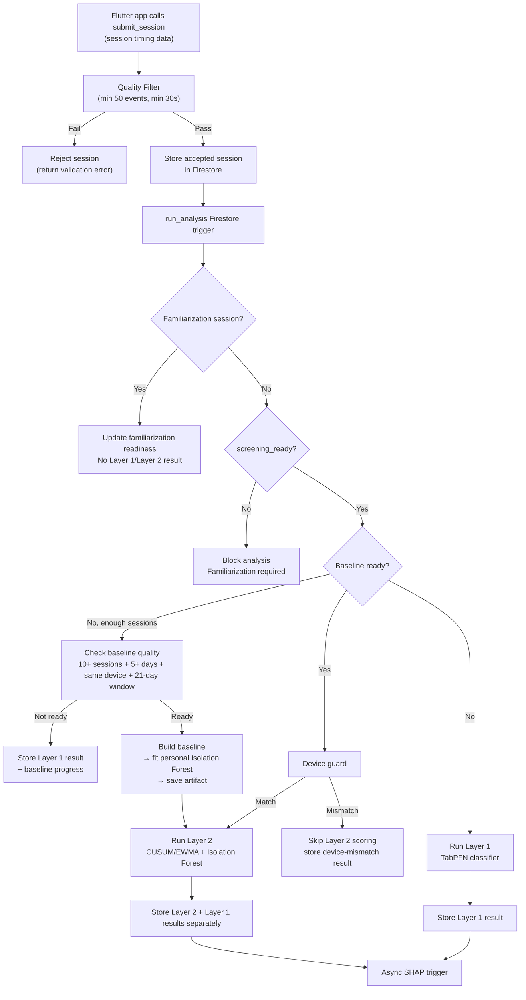
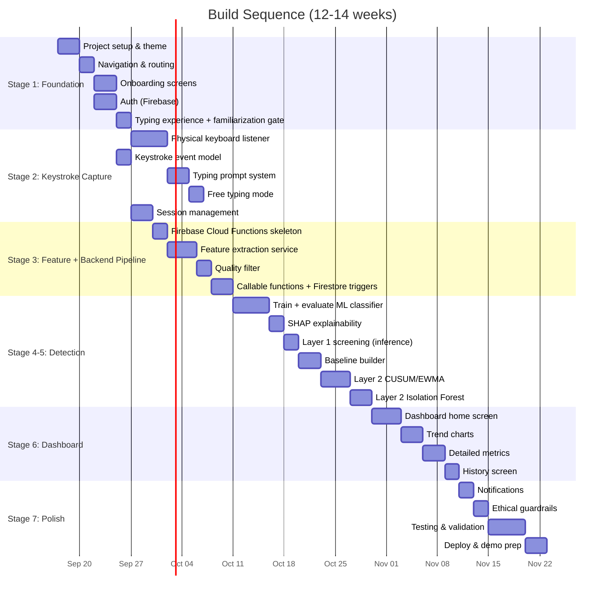

# Parkinson's Early Screening & Monitoring App — Full Implementation Plan

---

## ⚠️ Pre-Build Checklist (Do This Before Stage 1)

Work through these in week 1. None require deep implementation — they're verification tasks — but each one changes how confidently you can plan the weeks after it, and finding out late is far more costly than finding out now.

| # | Check | Why it matters | Status |
|---|---|---|---|
| 1 | Download both datasets yourself and confirm access terms (neuroQWERTY appears openly downloadable for research use directly from MIT's site; verify this directly rather than assuming — if either turns out to need a credentialed/DUA process, that's a multi-day-to-weeks delay to plan around) | Blocks all of Stage 4 if access is gated and unplanned for | ☐ |
| 2 | Inspect the actual file structure of both datasets — labels are **not** columns on the keystroke logs themselves; they live in separate per-subject ground-truth files (e.g. neuroQWERTY's `GT_DataPD_MIT-CSxPD.csv`, Tappy's separate participant metadata file) and must be joined by subject ID | The example code assumes a `parkinsons_label` column exists on every row — it doesn't; the join step must be written explicitly (see fix in Stage 4.1 below) | ☐ |
| 3 | Do a tiny spike: load both datasets, extract the 4 shared features (HT/FT/PP/RR) for ~5 subjects each, confirm units/scales are comparable | Confirms the harmonization plan (Stage 4.1) actually works before you build the full pipeline around it | ☐ |
| 4 | Check what GPU compute you actually have access to (free Colab, university cluster, anything) | TabPFN v2 and Chronos fine-tuning are gradient training jobs — likely slow or impractical on a bare laptop CPU | ☐ |
| 5 | Deploy a minimal Firebase Cloud Function bundling `torch` + `tabpfn` before building anything on top of it | Tests whether Firebase's deployment size limit is a blocker for the whole "stay on Firebase" decision — want this known in week 1, not after Stage 6 is built on top of it | ☐ |
| 5a | Before committing to the backend architecture at all: build a throwaway Flutter Desktop app targeting **your actual dev OS (Windows, if that's what you're on)**, add `firebase_core`/`firebase_auth`/`cloud_firestore`, and confirm sign-in + a Firestore read/write actually work end-to-end | Firebase's desktop plugin support (Stage 1.1) is documented as "more limited than mobile" in general, but the real risk is *your specific* OS + Flutter version combination — a general "it mostly works" isn't the same as verified on your machine. This is upstream of everything else in this plan; if it fails, the REST-API fallback (Stage 1.1) needs to be the real plan, not a footnote | ☐ |
| 6 | Verify `tabpfn-extensions`' current fine-tuning API against Prior Labs' live docs before writing final code | Package/class names can drift between versions; don't copy the plan's example code verbatim without checking it matches what's actually installed | ☐ |
| 7 | Check whether Chronos's fine-tuning handles irregular time gaps between sessions, or expects regular intervals | Tappy participants didn't type on a fixed schedule — gaps are likely and could break a naive fine-tune if unhandled | ☐ |
| 8 | Internalize the Tappy signal finding before you start: a 2026 replication on an 80-subject balanced Tappy sample found leave-one-out AUC = 0.377 (below chance); standard features scored 0.45–0.46 | This is expected, not a bug in your pipeline — see Stage 4.0. Knowing this going in changes what "success" looks like for Layer 1 and reinforces why Layer 2 is the project's real contribution | ☐ |
| 9 | Set an explicit fallback checkpoint on your calendar: if TabPFN v2 fine-tuning isn't working by [date], fall back to the Random Forest baseline as your primary reported result | That fallback is fully specified in this plan (Stage 4.4) — treat it as a real checkpoint, not last-resort panic. (Chronos, item #7, is optional from the start — Stage 5.3a — so there's no equivalent "fallback" needed for it; either it works as a bonus experiment or it's simply left out of the report) | ☐ |
| 10 | Verify whether **age and sex/gender metadata are available at subject level in both training datasets**, how they are defined, their missingness, and the time point they represent. Tappy v1.0 explicitly provides birth year and gender; the official neuroQWERTY MIT-CSXPD subject summary does **not** list age or gender. | Prevents accidental demographic data leakage or forced imputation. The core pooled model must remain typing-only unless comparable demographic covariates are available for both datasets; demographic-aware modeling can be a secondary Tappy analysis. | ☐ |

---

## Overview

A Flutter **desktop** app (Windows/macOS/Linux) for **personalized Parkinson's-related motor monitoring and screening research**. The core objective is not typing for its own sake: typing dynamics are one objective digital motor measure, complemented by a short keyboard motor task and a brief user-reported symptom check-in. Before screening, the app asks about typing familiarity and runs a short familiarization phase so typing skill does not get mistaken for a motor-pattern difference. The app also collects a small set of demographic context variables — **age and sex/gender information** — because age and sex can influence Parkinson's phenotype and motor performance. These are treated as subject-level covariates, not as typing features, and are used conservatively because the two training datasets do not provide the same demographic metadata. Two detection layers then operate: **Layer 1** (compare typing features to reference research data) and **Layer 2** (compare the user's typing and motor-task measures to their own history). A separate symptom check-in is kept as patient context and is not used as a diagnostic score. The app never diagnoses — it flags unusual or changing patterns and recommends discussing persistent changes with a healthcare professional. No clinician report/export is part of the current project scope.

**Why physical keyboard, not touchscreen:** the reference data used throughout this project (the Tappy Keyboard dataset) was itself collected from real physical-keyboard typing in a Parkinson's research context. Capturing live data on a physical keyboard keeps the live input and the reference data in the same modality — same key travel, same motor mechanics — instead of comparing touchscreen taps to physical key presses. This removes a domain-mismatch problem the touchscreen version would otherwise have had to explain away (see Stage 10.4).

**Go-to-market:** institutional-first. Rather than a general consumer app store release, the initial rollout targets clinics, neurologists, research institutions, and health authorities — parties equipped to interpret screening output responsibly and who can support a paid/licensed model. A lower-cost or subsidized path for individual users remains a stated long-term goal rather than an initial requirement, so the tool doesn't read as pay-gated health screening in its current form.

---

## Tech Stack

| Layer | Technology | Reason |
|---|---|---|
| **Frontend** | Flutter Desktop (Dart), Windows/macOS/Linux | Precise physical key-event timing via `HardwareKeyboard`/`RawKeyboardListener`, scoped to the focused typing field during an active session — single codebase across desktop OSes, you know it already |
| **State Mgmt** | Riverpod | Clean, testable, scales well for health apps |
| **Backend** | Firebase Cloud Functions (Python, 2nd gen) | All-in-one with Firebase, Python supported natively, generous free tier (2M invocations/mo) |
| **Database** | Firebase Firestore | Zero server management, real-time sync, easy auth — perfect for a final year demo |
| **Auth** | Firebase Auth | Email/password + Google sign-in, minimal setup |
| **Analysis** | Python (numpy, scipy, scikit-learn) — runs inside Cloud Functions | Feature extraction, baseline modeling |
| **AI/ML Model** | TabPFN v2 (Apache 2.0 tabular foundation model, fitted/fine-tuned — say which, Stage 4.4) + Random Forest baseline; CUSUM/EWMA + Isolation Forest for Layer 2 (core); SHAP for explainability (async) | Layer 1: TabPFN v2 uses the shared typing-feature space supported by Tappy + neuroQWERTY (Stage 4). The added Parkinson-specific motor task is **not** fed into Layer 1 unless a compatible labelled training dataset becomes available. Layer 2: per-user Isolation Forest + CUSUM/EWMA over typing and motor-task features (Stage 5.2-5.3). Symptom check-ins remain contextual and are not part of the diagnostic ML score. Chronos is optional (5.3a). Layer 1 and Layer 2 are shown separately, never blended (5.5) |
| **Datasets** | Tappy Keystroke Data + neuroQWERTY MIT-CSXPD (both PhysioNet, both physical-keyboard PD research data) | Two real datasets, harmonized to a common feature space (Stage 4.1) |
| **Hosting** | Firebase (Cloud Functions + Firestore + Cloud Storage + Auth) | Single platform; Cloud Storage persists per-user anomaly-model artifacts |
| **Charts** | fl_chart (Flutter) | Beautiful, animated charts for the dashboard |

### Backend Decision

Firebase (Cloud Functions + Firestore) is the confirmed backend — do not switch without good reason. Supabase, Render+Postgres, Convex, and Vercel were all evaluated and rejected: Firebase is the only option needing zero rewrite of the Python analysis pipeline (numpy/scipy/scikit-learn run natively in Cloud Functions 2nd gen) and it has official, mature Flutter tooling. The others either require a separate Python service (Supabase, Convex), full server ownership with cold-start free tiers (Render), or aren't a comparable backend-as-a-service at all (Vercel).

---

## Project Structure

```
parkinson_app/
├── lib/                          # Flutter Desktop app
│   ├── main.dart
│   ├── app.dart                  # App-level config, theme, routing
│   ├── core/
│   │   ├── theme/
│   │   │   ├── app_theme.dart         # Dark/light theme, colors, typography
│   │   │   ├── app_colors.dart        # Curated color palette
│   │   │   └── app_text_styles.dart   # Typography system
│   │   ├── constants/
│   │   │   └── app_constants.dart     # Config values, API URLs
│   │   ├── router/
│   │   │   └── app_router.dart        # GoRouter navigation
│   │   └── utils/
│   │       ├── timestamp_utils.dart   # High-precision timing helpers
│   │       └── session_utils.dart     # Session quality filters
│   │
│   ├── data/
│   │   ├── models/
│   │   │   ├── keystroke_event.dart        # Single key press/release event
│   │   │   ├── typing_session.dart         # One complete typing session
│   │   │   ├── session_features.dart       # Extracted features for one session
│   │   │   ├── user_baseline.dart          # Personal baseline snapshot
│   │   │   ├── screening_result.dart       # Layer 1 or Layer 2 result
│   │   │   └── user_profile.dart           # Demographic context + typing-experience profile
│   │   ├── repositories/
│   │   │   ├── auth_repository.dart
│   │   │   ├── session_repository.dart     # CRUD for typing sessions
│   │   │   ├── baseline_repository.dart    # CRUD for personal baselines
│   │   │   └── result_repository.dart      # CRUD for screening results
│   │   └── services/
│   │       ├── api_service.dart            # HTTP calls to Firebase Cloud Functions
│   │       ├── keystroke_capture_service.dart  # Session-scoped physical key-event listener (active only while typing field is focused)
│   │       └── local_storage_service.dart  # Offline buffering
│   │
│   ├── features/
│   │   ├── onboarding/
│   │   │   ├── screens/
│   │   │   │   ├── welcome_screen.dart          # App intro + consent
│   │   │   │   ├── how_it_works_screen.dart     # Explain the 2 layers simply
│   │   │   │   └── consent_screen.dart          # Privacy consent
│   │   │   └── widgets/
│   │   │       ├── feature_card.dart
│   │   │       └── consent_checkbox.dart
│   │   │
│   │   ├── auth/
│   │   │   ├── screens/
│   │   │   │   ├── login_screen.dart
│   │   │   │   └── signup_screen.dart
│   │   │   └── providers/
│   │   │       └── auth_provider.dart
│   │   │
│   │   ├── typing_test/                    # ⭐ CORE FEATURE
│   │   │   ├── screens/
│   │   │   │   ├── typing_screen.dart           # Main typing interface (text field + prompt, no on-screen keyboard)
│   │   │   │   ├── familiarization_screen.dart   # Practice mode before Layer 1
│   │   │   │   └── session_complete_screen.dart  # Post-session summary
│   │   │   ├── widgets/
│   │   │   │   ├── typing_prompt.dart           # Text to type (neutral sentences)
│   │   │   │   ├── typing_progress_bar.dart     # Visual progress indicator
│   │   │   │   └── session_timer.dart           # Session duration display
│   │   │   └── providers/
│   │   │       ├── typing_session_provider.dart
│   │   │       ├── keystroke_provider.dart
│   │   │       └── familiarization_provider.dart # Experience level, required practice count, readiness gate
│   │   │
│   │   ├── free_typing/                    # Passive monitoring (type anything)
│   │   │   ├── screens/
│   │   │   │   └── free_typing_screen.dart      # Notepad-like free typing
│   │   │   └── widgets/
│   │   │       └── notepad_area.dart
│   │   │
│   │   ├── dashboard/                      # ⭐ RESULTS & INSIGHTS
│   │   │   ├── screens/
│   │   │   │   ├── dashboard_screen.dart        # Main dashboard home
│   │   │   │   ├── detailed_metrics_screen.dart # Deep-dive into specific metrics
│   │   │   │   └── history_screen.dart          # Past sessions timeline
│   │   │   ├── widgets/
│   │   │   │   ├── metric_trend_chart.dart      # Line chart of metric over time
│   │   │   │   ├── session_summary_card.dart    # Quick session overview
│   │   │   │   ├── baseline_progress.dart       # "X sessions until baseline ready"
│   │   │   │   ├── layer1_result_card.dart      # Reference comparison result — always its own card, never merged (Stage 5.5, 7.1)
│   │   │   │   ├── layer2_result_card.dart      # Personal drift result — shows "building"/"established" confidence state (Stage 7.1)
│   │   │   │   └── recommendation_banner.dart   # "Consult a doctor" banner
│   │   │   └── providers/
│   │   │       ├── dashboard_provider.dart
│   │   │       └── metrics_provider.dart
│   │   │
│   │   ├── profile/
│   │   │   ├── screens/
│   │   │   │   ├── profile_screen.dart
│   │   │   │   └── settings_screen.dart
│   │   │   └── widgets/
│   │   │       └── profile_stats_card.dart
│   │   │
│   │   └── info/
│   │       └── screens/
│   │           ├── about_screen.dart            # What this app does
│   │           ├── faq_screen.dart              # Common questions
│   │           └── disclaimer_screen.dart       # Medical disclaimer
│   │
│   └── shared/
│       └── widgets/
│           ├── app_bottom_nav.dart          # Bottom navigation bar
│           ├── gradient_background.dart     # Reusable gradient container
│           ├── glass_card.dart              # Glassmorphism card
│           ├── animated_status_indicator.dart
│           └── loading_shimmer.dart         # Skeleton loading
│
├── functions/                      # Firebase Cloud Functions (Python)
│   ├── main.py                    # Cloud Functions entry point
│   ├── requirements.txt           # numpy, scipy, scikit-learn, joblib, shap, google-cloud-storage
│   ├── models/
│   │   ├── train_model.py         # ⭐ Fine-tunes/fits TabPFN v2 on pooled Tappy + neuroQWERTY (Stage 4.4, run offline)
│   │   ├── train_anomaly_model.py # ⭐ Trains a per-user Isolation Forest at baseline-build time (Stage 5.3)
│   │   ├── train_forecasting_model.py # 🧪 EXPERIMENTAL, optional — fine-tunes a shared Chronos model on Tappy's longitudinal sequences (Stage 5.3a, run offline, not part of core pipeline)
│   │   ├── chronos_typing_forecast_experimental/   # 🧪 Saved experimental checkpoint, if attempted — NOT bundled with the deployed Cloud Function
│   │   └── parkinson_screening_model.joblib  # Saved trained classifier, bundled with the Cloud Function deployment
│   ├── services/
│   │   ├── feature_extraction.py  # ⭐ Keystroke → features pipeline
│   │   ├── layer1_screening.py    # ⭐ Loads trained classifier, scores sessions (Stage 4.6)
│   │   ├── layer2_drift.py        # ⭐ Personal drift detection (CUSUM/EWMA)
│   │   ├── layer2_anomaly.py      # ⭐ Personal Isolation Forest anomaly scoring (Stage 5.3)
│   │   ├── forecasting.py         # 🧪 EXPERIMENTAL, optional — Chronos forecast-drift scoring (Stage 5.3a); not imported by submit_session
│   │   ├── device_guard.py        # ⭐ Device-mismatch guard before Layer 2 scoring (Stage 5.1a)
│   │   ├── explain.py             # ⭐ SHAP explainability for Layer 1 results (Stage 4.5)
│   │   ├── baseline_builder.py    # ⭐ Personal baseline construction
│   │   ├── quality_filter.py      # Session quality filtering
│   │   ├── reference_stats.py     # Precomputes reference percentiles from pooled Tappy + neuroQWERTY
│   │   └── harmonize_datasets.py  # ⭐ Maps both datasets into one common feature schema (Stage 4.1)
│   ├── utils/
│   │   ├── stats.py               # Statistical helper functions
│   │   └── constants.py           # Feature names, thresholds
│   └── data/
│       ├── tappy_dataset/         # Raw + preprocessed Tappy Keystroke Data (at-home, longitudinal, ~145 sessions/subject)
│       └── neuroqwerty_dataset/   # Raw + preprocessed neuroQWERTY MIT-CSXPD (clinic-collected, raw timestamps)
│
└── assets/
    ├── images/                    # App icons, illustrations
    ├── animations/                # Lottie animations
    └── prompts/                   # Typing prompt sentences
        └── neutral_sentences.json # Neutral, easy-to-type sentences
```

---

## Stage-by-Stage Implementation

---

## Stage 1 — Foundation & Core Setup
**Goal:** Project skeleton, theme, navigation, auth — app opens, looks professional, user can sign up/log in.

### 1.1 Project Initialization
- Include `google-cloud-storage` in the Python functions environment because per-user Isolation Forest artifacts are persisted in Cloud Storage.
- Create Flutter project with `flutter create parkinson_app`, then enable desktop targets: `flutter config --enable-windows-desktop --enable-macos-desktop --enable-linux-desktop`
- Set up folder structure as shown above
- Add dependencies to `pubspec.yaml`:
  ```yaml
  dependencies:
    flutter_riverpod: ^2.5.1
    go_router: ^14.0.0
    firebase_core: ^3.0.0
    firebase_auth: ^5.0.0
    cloud_firestore: ^5.0.0
    fl_chart: ^0.69.0
    google_fonts: ^6.2.0
    lottie: ^3.1.0
    shared_preferences: ^2.3.0
    http: ^1.2.0
    intl: ^0.19.0
    uuid: ^4.5.0
    shimmer: ^3.0.0
  ```
- Configure Firebase project for desktop platforms (Windows/macOS/Linux) — Firebase's official desktop support is more limited than mobile, so verify `firebase_auth`/`cloud_firestore` desktop plugin support early; fall back to a thin custom auth/REST layer against Firestore's REST API if a given plugin lacks a Linux/Windows build

### 1.2 Design System & Theme
- **Color Palette:** A calming, accessible, health-oriented palette — NOT generic blues
  - Primary: Deep Teal `#0D6E6E` (trust, health)
  - Secondary: Warm Coral `#FF6B6B` (attention, warmth)
  - Accent: Soft Gold `#FFD93D` (positivity)
  - Background: Off-Black `#0A0E21` (dark mode) / Warm White `#FAF9F6` (light mode)
  - Surface: Translucent cards with glassmorphism
  - Status colors: Green (normal), Amber (watch), Orange (attention), never Red (no alarm)
- **Typography:** Google Fonts `Inter` for body, `Outfit` for headings — clean, modern, accessible
- **Corner Radius:** 16px cards, 12px buttons — soft, friendly feel
- **Spacing:** 8px grid system
- **Animations:** 300ms standard duration, ease-in-out curves

### 1.3 Navigation
- Bottom navigation bar with 4 tabs:
  1. 🏠 **Home** (Dashboard)
  2. ⌨️ **Type** (Typing Test / Free Typing)
  3. 📊 **Insights** (Detailed Metrics & History)
  4. 👤 **Profile** (Settings, About, FAQ)
- GoRouter for declarative routing with auth guards

### 1.4 Onboarding Flow (3 screens)
- **Screen 1 — Welcome:** App logo + animated illustration. Tagline: *"Your typing tells a story about your health."* Clean, no medical jargon.
- **Screen 2 — How It Works:** 3 simple cards with icons:
  - "Type naturally" → "We study timing" → "Get insights over time"
- **Screen 3 — Privacy & Consent:** Clear explanation that only timing data is collected, never content. Checkbox consent. Link to full disclaimer.

### 1.5 Authentication
- Firebase Auth with email/password + Google Sign-In
- Clean login/signup screens with form validation
- Auto-redirect to onboarding for new users, dashboard for returning users
- **Password reset flow:** "Forgot password" link → Firebase Auth's built-in reset email → confirmation screen. Don't build this custom — Firebase Auth handles the token/expiry logic.
- **Session persistence:** Firebase Auth's SDK persists the signed-in state locally by default (desktop included) — on app relaunch, check `FirebaseAuth.instance.currentUser` before showing the login screen rather than always starting there.
- **Sign-out:** clears local session state and any locally-buffered unsynced typing sessions (Stage 2.4) should be flushed to the backend *before* sign-out completes, or explicitly warned about if still pending, so a user doesn't lose an unsynced session.
- **This is not just a UI concern.** Every `userId` used throughout the Firestore schema (Stage 6.4) comes from `req.auth.uid` in Cloud Functions and from Firebase Auth's current user client-side — the Security Rules below (6.5) are what actually enforce that a signed-in user can only ever read or write their own data. Auth without rules is just a login screen; the rules are what make it real access control.

### 1.6 Typing Experience Assessment & Familiarization Gate
- Immediately after first login/onboarding, ask: **“How familiar are you with typing on a physical keyboard?”**
- Options:
  - **Regular typist** — types frequently / comfortable with a physical keyboard
  - **Occasional typist** — types sometimes but not regularly
  - **Not familiar** — rarely types / not comfortable with a physical keyboard
- Store the answer as `typing_experience_level` in the user profile. It is used **only to determine familiarization requirements** and is not used as an ML or diagnostic feature.
- Every new user completes **at least 1 familiarization session** before Layer 1.
- **Not familiar users complete 2 familiarization sessions.**
- Occasional typists complete 1 session, with a second allowed if the readiness check is not met.
- Familiarization sessions are practice only and are excluded from Layer 1 scoring, personal baseline construction, Isolation Forest training, CUSUM/EWMA, and health-related results.
- After the required practice sessions, run a **typing-stability/readiness check** on the last two eligible practice sessions using core timing features (HT, FT, IKL, typing speed, pause frequency, hand asymmetry).
- If the pattern is not sufficiently stable, collect another practice session and reassess. The self-reported experience level never overrides poor-quality or unstable practice data.
- Initial readiness threshold: `FAMILIARIZATION_MAX_MEDIAN_APC = 15%` as an **engineering starting value**, not a medical threshold. Compute median absolute percentage change (MAPC) between the two practice sessions across the core timing features, using a small denominator floor for near-zero features. If MAPC ≤ 15%, mark the typing pattern sufficiently stable for screening; otherwise collect another practice session and reassess.
- For a user with only **one required practice session** (regular typist), readiness is based on session quality plus completion of the familiarization step; a second practice session can be requested if the first session is noisy or unstable. **Not-familiar users always have two practice sessions**, so the two-session stability check is available by default.
- Layer 1 becomes available only after the familiarization/readiness gate passes.

### 1.7 Demographic Context Collection (Age + Sex/Gender)
- During onboarding, collect:
  - `age_years` — continuous age in whole years at onboarding/screening.
  - `sex_gender` — record the source terminology exactly (for example, the training dataset may provide a binary `Gender` field). Do **not** infer or relabel a person's sex/gender from typing data.
- Explain clearly: **“These details are used only to adjust/reference the research model and evaluate whether performance differs across groups. They are not typing features and are never used to diagnose you.”**
- Allow `prefer_not_to_say` / `unknown` for live users. Missing demographic information must never block the typing pipeline.
- Store these variables once in `user_profile`; do **not** duplicate them into every session document unless a model-scoring record needs an immutable snapshot.
- For longitudinal Tappy training, compute `age_at_session` from the participant's birth year and session date when possible; for a live user, use `age_years` captured at onboarding as the stable demographic context for the project timeframe.
- **Important modeling rule:** age and sex/gender are **subject-level covariates**, not dynamic typing features. Layer 2 must not treat them as changing inputs to CUSUM/EWMA or Isolation Forest.

---


### 1.8 Parkinson's Personalization Scope — Must vs Important
- **MUST HAVE 1 — Parkinson's Context Profile:** Every user is asked how they are using the app (diagnosed Parkinson's / monitoring possible changes / research or healthy volunteer). Diagnosed-PD users may optionally provide diagnosis year, main reported symptoms, and more-affected side. These fields personalize the app but never become diagnostic ML features.
- **MUST HAVE 2 — Daily Motor & Symptom Check-In:** A brief 20–30 second self-report of tremor, stiffness/rigidity, slowness, balance/walking difficulty, fatigue, and sleep quality. Keep this as a separate contextual time series; it must not be converted into a diagnostic score.
- **MUST HAVE 3 — Parkinson-specific Motor Task:** A short alternating-key task is part of the daily/regular session and feeds Layer 2 alongside typing features. It provides a second objective motor signal related to repetitive movement, while remaining separate from Layer 1 because the reference datasets do not contain the same task.
- **IMPORTANT BUT OPTIONAL — Medication / ON-OFF Context:** For diagnosed-PD users, optionally record ON/OFF/not-sure status and time since last medication. Store it as context for longitudinal visualization and later exploratory analysis; do not make it a core ML input or infer medication response from one session.
- **OUT OF CORE SCOPE:** Clinical report generation, gait analysis, voice analysis, camera-based tremor detection, smartwatch integration, and additional sensor modalities are not part of this final-year build.

### 1.8 Parkinson's Context Profile (Personalization Layer)
- After demographic context and before screening begins, ask the user how they are using the application:
  - **Diagnosed with Parkinson's disease**
  - **Monitoring possible movement changes**
  - **Research / healthy volunteer**
- Store the selected mode as `monitoring_profile_type`.
- For users who voluntarily select the diagnosed-PD pathway, optionally collect:
  - `diagnosis_year`
  - `main_reported_symptoms`: tremor, stiffness/rigidity, slowness, balance/walking difficulty, other
  - `more_affected_side`: left / right / both / unsure
- These are **context fields**, not diagnostic evidence and not direct inputs to the Layer 1 PD classifier.
- Never infer diagnosis, symptom presence, or affected side from typing or motor-task data.
- All health-context fields are optional and require explicit consent. A user can use the core typing workflow without disclosing diagnosis information.

### 1.9 Daily Motor & Symptom Check-In
- Add a short optional check-in immediately before or after each **screening** session (not during familiarization unless the user wants to preview it).
- Keep it to approximately 20–30 seconds so adherence remains realistic.
- Use simple 0–10 self-ratings:
  - Tremor today
  - Stiffness/rigidity today
  - Slowness today
  - Balance/walking difficulty today
  - Fatigue today
  - Sleep quality last night (reverse-coded only for visualization if needed; keep raw response stored)
- Add an optional free-text note only if the user explicitly wants it; do not send free-text notes to the ML model.
- For diagnosed-PD users, an optional **medication context** can be shown: `ON`, `OFF`, `not sure`, `not applicable`, plus optional hours since last medication. This is contextual only and is not used to claim medication effect.
- For users without a diagnosis, use neutral wording such as **“Daily motor and wellness check-in”** rather than implying they have Parkinson's disease.
- Do **not** feed symptom ratings or medication state into Layer 1 or Layer 2 during the core build. They are stored as contextual time series and may be used later for exploratory correlation analysis after sufficient longitudinal data exists.
- Never convert the check-in into a clinical score or call it UPDRS/MDS-UPDRS.

## Stage 2 — Keystroke Capture Engine (The Core)
**Goal:** Capture precise keystroke timing data during typing sessions, from the user's **physical keyboard**.

### 2.1 Physical Keyboard Listener Service
- No on-screen keyboard is rendered. The user types on their own physical keyboard into a normal text field; the key listener is attached to — and only active while — that specific typing field has focus, for the duration of an active session. It is **not** a system-wide global hook capturing keystrokes anywhere else on the OS or in other applications; closing the typing screen or moving focus elsewhere stops capture entirely. Flutter Desktop's `HardwareKeyboard` (or `RawKeyboardListener` for wider OS coverage) provides the underlying key-down/key-up events, scoped to this focused widget.
- Capture with millisecond precision, using raw OS-level event timestamps rather than the UI frame clock (more accurate and jitter-resistant than the touchscreen `GestureDetector` approach it replaces):
  - Key down → record press timestamp
  - Key up → record release timestamp
- Each key-down/key-up pair is processed **in-memory, on-device, immediately** into a `KeystrokeEvent` — `keyId` exists only transiently during this derivation step and is never the thing that gets stored or sent:
  ```dart
  class KeystrokeEvent {
    final int pressTimestamp;     // microseconds/milliseconds since epoch (OS event time)
    final int releaseTimestamp;   // microseconds/milliseconds since epoch (OS event time)
    final String hand;            // "left" or "right" — DERIVED from key position, then keyId is discarded
    final int row;                // keyboard row (0=top, 1=middle, 2=bottom) — also derived, keyId discarded
    final String keyType;         // "character" | "backspace" | "control" — see 2.1a
  }
  ```
- **⚠️ Privacy — derive, then discard, don't persist raw key identity.** The raw physical key code (`"KeyQ"`, `"KeyW"`, etc.) is used only transiently, at the moment of capture, to compute `hand`/`row`/`keyType` — it is not a field on the stored/transmitted `KeystrokeEvent`, not written to local buffers, and not sent to the backend. This is a stronger guarantee than "we only use it for X": the raw key code simply doesn't exist past the derivation step, so there's nothing resembling a keylogger payload to accidentally log, sync, or leak later. Modifier/shortcut key combinations (Ctrl, Alt, Cmd, function keys) are excluded from feature computation entirely.
- **Platform note:** key-event access differs by OS (Windows uses raw input APIs, macOS requires Accessibility/Input Monitoring permission, Linux depends on the desktop environment). Budget time in Stage 1 to verify Flutter's key-event plugin coverage on all three target OSes before relying on it for Stage 2, and be ready to request the relevant OS permission explicitly with a clear consent explanation (this matters even more for a desktop app, since OS-level keyboard access is a more sensitive permission than touch events were).

### 2.1a Key-Type Categorization (feeds Stage 3.2's filtering)
Not every key event should count toward rhythm features. Tag each event **at the moment of capture**, as part of the same derive-then-discard step above:
- **`character`** — letters, numbers, punctuation, space. These drive HT/FT/IKL.
- **`backspace`** — tracked separately. A correction burst (holding Backspace, or several rapid presses) has completely different dynamics from normal typing rhythm and will distort Flight Time / Pause Frequency if mixed in. Compute a dedicated `backspace_rate` feature (corrections per minute) instead of folding it into FT/IKL — see Stage 3.1.
- **`control`** — Shift, Ctrl, Alt, Tab, Enter, arrow keys, Cmd/Meta. Already excluded from feature computation; explicitly exclude any FT/IKL transition where either side of the pair is a control key, not just the control key's own hold time (a Shift→letter transition isn't representative finger-transition speed).

### 2.2 Familiarization Session Mode
- Provide a dedicated **Practice / Familiarization** mode using the same physical-keyboard capture engine as screening sessions.
- Clearly tell the user that practice is **not used for a health result**; its purpose is to become comfortable with the app and typing task.
- Use short neutral sentences with the same interaction style as the later structured test.
- Mark practice sessions as `session_phase = "familiarization"` and exclude them from all screening/baseline calculations.
- Required practice count:
  - Regular typist: **1 session**
  - Occasional typist: **1 session**, with a second allowed if stability is not met
  - Not familiar: **2 sessions**
- Run the Stage 1.6 readiness check after the required practice sessions. If needed, collect an additional practice session.
- Once the readiness check passes, set `screening_ready = true` and enable Layer 1.
- Practice sessions remain visible in history but are labelled **Practice** and never receive a Layer 1/Layer 2 health status.

**Readiness calculation (initial implementation):**
```python
FAMILIARIZATION_MAX_MEDIAN_APC = 0.15  # engineering starting point

def familiarization_ready(previous: SessionFeatures, current: SessionFeatures) -> bool:
    core_features = [
        "ht_mean", "ht_std", "ft_mean", "ft_std",
        "ikl_mean", "ikl_std", "typing_speed",
        "pause_frequency", "hand_asymmetry",
    ]
    relative_changes = []
    for name in core_features:
        a = float(getattr(previous, name))
        b = float(getattr(current, name))
        denominator = max(abs(a), abs(b), 1e-6)
        relative_changes.append(abs(a - b) / denominator)
    median_apc = np.median(relative_changes)
    return median_apc <= FAMILIARIZATION_MAX_MEDIAN_APC
```
This is a **readiness/stability heuristic**, not a health threshold. Recalibrate it after collecting pilot data.

### 2.3 Typing Prompt System
- Show neutral, low-cognitive-load sentences for structured typing tests
- Sentences stored in `neutral_sentences.json`:
  - "The sun set behind the tall mountains."
  - "She walked to the store on a quiet morning."
  - (50+ neutral sentences, varied length, common words)
- Display the prompt above the keyboard, highlight current word, show progress
- Minimum session: 30 seconds of active typing, ~50+ key events
- The same prompt engine is reused for familiarization and screening, but `session_phase` clearly distinguishes the two.


### 2.3 Parkinson-Specific Active Motor Task (Core Feature)
- Add a **10–15 second alternating-key task** after the structured typing task.
- Example instruction: repeatedly alternate between two visible keys (for example, `F` and `J`) as quickly and accurately as comfortable.
- Run the task separately for left/right orientation when feasible so side-specific performance can be tracked without claiming a diagnosis.
- Measure only task mechanics, not typed content:
  - total valid alternating taps
  - mean inter-tap interval
  - inter-tap variability
  - missed/extra taps
  - left/right task asymmetry where applicable
  - within-task slowing (change in tap interval from early to late task)
- The task is **not part of the Tappy/neuroQWERTY Layer 1 training matrix** because those datasets do not provide the same standardized motor-task measurement.
- The motor-task features become an important input to **Layer 2 personal longitudinal monitoring** alongside typing features.
- Keep the task short and low-burden; it is a targeted motor assessment, not a speed competition.
- Research support: computerized alternating finger-tapping tasks have been studied as objective measures related to Parkinson's motor severity, but this project must treat its keyboard implementation as a research-derived task rather than a clinically validated examination.

### 2.4 Free Typing Mode
- A notepad-style screen where users can type anything freely
- Same keystroke capture running in background
- The text itself is displayed on-screen but NEVER stored or sent — only timing data is extracted and saved
- Useful for passive, natural typing collection

### 2.5 Session Management
- A `TypingSession` wraps all `KeystrokeEvent` objects from one sitting:
  ```dart
  class TypingSession {
    final String sessionId;
    final String userId;
    final DateTime startTime;
    final DateTime endTime;
    final String mode;           // "structured", "free", or "motor_task"
    final String sessionPhase;   // "familiarization" or "screening"
    final List<KeystrokeEvent> events;
    final int totalKeystrokes;
    final String deviceId;       // ⭐ stable per-keyboard identifier — see 2.5, drives Stage 5's device-consistency check
    final Map<String, dynamic> metadata;  // OS, session quality flags, etc.
  }
  ```
- `deviceId` should be as stable as the platform allows — e.g. a hash of OS-reported keyboard/HID device info where available, falling back to a simple user-set label ("laptop keyboard" / "external keyboard") if the OS doesn't expose one. It doesn't need to be perfectly precise, just consistent enough to detect "this session was probably typed on a different keyboard than usual."
- Buffer events locally, batch-send to backend when session completes
- Offline support: store sessions in SharedPreferences, sync when online

### 2.6 Session Quality Filters
- Discard sessions that are too short (< 30 seconds active typing)
- Discard sessions with too few keystrokes (< 50 events)
- Flag sessions at unusual times (e.g., 3 AM) with metadata — don't discard, but weight lower
- `deviceId` (2.5) is captured on every session — this alone doesn't filter anything at Stage 2, but Stage 5's baseline and drift logic depend on it to tell a real personal change apart from a keyboard swap. See Stage 5.1 and 5.3.
- **Familiarization sessions are never eligible for Layer 1/Layer 2 analysis.** Keep them for history/audit, but filter them out before reference screening, baseline construction, CUSUM/EWMA, Isolation Forest training, and health-monitoring trend charts.

---

## Stage 3 — Feature Extraction Pipeline
**Goal:** Convert raw keystroke events into meaningful typing features.

### 3.1 Core Features (derived from Tappy dataset research)

| Feature | Definition | Unit | Why It Matters |
|---|---|---|---|
| **Hold Time (HT)** | Time key is pressed down (release - press) | ms | Most reliable PD biomarker — bradykinesia shows as longer holds |
| **Flight Time (FT)** | Time between releasing one key and pressing next | ms | Measures finger transition speed |
| **Inter-Key Latency (IKL)** | Time between pressing one key and pressing next | ms | Overall typing rhythm |
| **HT Mean** | Average hold time across session | ms | Baseline typing "weight" |
| **HT Std Dev** | Variability in hold times | ms | PD shows higher variability |
| **FT Mean** | Average flight time | ms | Baseline transition speed |
| **FT Std Dev** | Variability in flight times | ms | PD shows higher variability |
| **IKL Mean** | Average inter-key latency | ms | Overall speed metric |
| **IKL Std Dev** | Variability in latency | ms | Rhythm consistency |
| **Left Hand HT Mean** | Avg hold time for left-hand keys | ms | Hand asymmetry detection |
| **Right Hand HT Mean** | Avg hold time for right-hand keys | ms | Hand asymmetry detection |
| **Hand Asymmetry Ratio** | abs(Left HT - Right HT) / max(Left HT, Right HT) | ratio | PD often affects one side more |
| **Pause Frequency** | Count of gaps > 500ms per minute | count/min | Hesitation/freezing indicator |
| **Typing Speed** | Keystrokes per second | keys/sec | General motor speed (noisy) |
| **Session Consistency** | Coefficient of variation of IKL | ratio | How "regular" the rhythm is |
| **Backspace Rate** | Backspace presses per minute | count/min | Correction/error-rate signal, computed separately from FT/IKL so correction bursts don't distort rhythm features — see 2.1a |

### 3.2 Feature Extraction Service (Backend)
```python
# backend/services/feature_extraction.py
def extract_features(events: List[KeystrokeEvent]) -> SessionFeatures:
    """
    Takes raw keystroke events, returns computed features.
    All computation happens server-side for consistency.
    """
    # ⚠️ Only "character" events drive rhythm features. Backspace and control
    # keys are excluded here, not just from their own hold time — a
    # transition INTO or OUT OF a backspace/control key isn't representative
    # finger-transition speed, so it's dropped from FT/IKL too, not just HT.
    char_events = [e for e in events if e.key_type == "character"]
    backspace_events = [e for e in events if e.key_type == "backspace"]

    hold_times = [e.release_ts - e.press_ts for e in char_events]
    flight_times = [char_events[i+1].press_ts - char_events[i].release_ts
                    for i in range(len(char_events)-1)]
    inter_key = [char_events[i+1].press_ts - char_events[i].press_ts
                 for i in range(len(char_events)-1)]

    # Separate by hand
    left_ht = [ht for e, ht in zip(char_events, hold_times) if e.hand == "left"]
    right_ht = [ht for e, ht in zip(char_events, hold_times) if e.hand == "right"]

    session_duration_min = session_duration_sec / 60.0

    return SessionFeatures(
        ht_mean=np.mean(hold_times),
        ht_std=np.std(hold_times),
        ft_mean=np.mean(flight_times),
        ft_std=np.std(flight_times),
        ikl_mean=np.mean(inter_key),
        ikl_std=np.std(inter_key),
        left_ht_mean=np.mean(left_ht) if left_ht else None,
        right_ht_mean=np.mean(right_ht) if right_ht else None,
        hand_asymmetry=compute_asymmetry(left_ht, right_ht),
        pause_frequency=count_pauses(flight_times, threshold_ms=500),
        typing_speed=len(char_events) / session_duration_sec,
        session_consistency=np.std(inter_key) / np.mean(inter_key),  # CV
        backspace_rate=len(backspace_events) / session_duration_min,  # computed separately, not folded into FT/IKL
    )
```


### 3.2a Motor Task Feature Extraction
- Run a separate extraction function for `mode == "motor_task"`.
- Do not mix motor-task events into sentence-typing HT/FT/IKL statistics.
- Validate the expected alternating sequence and mark invalid or accidental presses as quality events rather than silently treating them as slow taps.
- Store motor-task features in the session feature schema with null values for non-motor-task sessions.

### 3.3 Outlier Removal
- Remove hold times > 2000ms (user paused, not a real key hold)
- Remove flight times > 3000ms (user was distracted or stepped away mid-sentence — this is the upper-bound cutoff that keeps a brief real-world interruption from skewing session-level FT/pause stats)
- This runs on the already-filtered `char_events` from Stage 3.2 (backspace/control transitions are already excluded before this step, not after)
- Use IQR method: remove events outside Q1 - 1.5*IQR to Q3 + 1.5*IQR for each feature
- Log outlier removal counts as quality metadata

### 3.4 Demographic Variables Are Context, Not Typing Features
- Keep two separate feature groups throughout the pipeline:
  - `TYPING_FEATURE_LIST`: HT, FT, IKL, variability, pauses, speed, hand asymmetry, backspace rate, etc.
  - `DEMOGRAPHIC_COVARIATES`: age and sex/gender metadata.
- Never manufacture demographic values for a dataset that does not contain them. The official neuroQWERTY MIT-CSXPD subject summary lists PD/control labels, UPDRS/tapping variables and typing speed, but **does not provide age or gender fields**. citeturn706327search3turn859525search0
- Therefore the **primary pooled Tappy + neuroQWERTY TabPFN model remains typing-feature based** so both datasets can contribute without discarding the neuroQWERTY cohort.
- Add a **secondary demographic-sensitivity analysis** on the Tappy cohort, where age and gender are available from the participant detail files, to measure whether adding these covariates changes performance. Tappy provides birth year and gender in its participant details. citeturn706327search0
- Use age as a continuous variable in the secondary model. Use sex/gender as a categorical variable exactly as recorded by the source. Only add an age×sex/gender interaction if the sample supports it; do not add it by default.
- For live scoring, demographic information may be used to select or contextualize an appropriate **statistical reference range** where sufficient control data exist, but it must not override the trained classifier or create a medical cutoff.

---

## Stage 4 — Layer 1: ML-Based Reference Screening ⭐ (Fine-Tuned Tabular Foundation Model)
**Goal:** Fine-tune a pretrained tabular foundation model (TabPFN v2) on **two** real physical-keyboard PD datasets — Tappy and neuroQWERTY MIT-CSXPD — and use it to screen a new user's typing features against learned patterns.

### 4.0 ⚠️ Read This Before Building Stage 4 — Expectation Setting
Recent literature is clear that **cross-subject PD classification from Tappy alone is hard**, and no model choice fixes that:
- A 2026 study found no significant PD/control feature difference on Tappy (all p > 0.5) and leave-one-out AUC of 0.377 — below chance; conventional hold/flight/latency features scored 0.45–0.46.
- A 2025 cross-dataset benchmark of eight deep architectures found Tappy consistently the hardest of four keystroke-PD datasets (46–71% AUC), attributed to its uncontrolled, free-text, at-home collection protocol.
- A 2022 meta-analysis (41 studies, 3,791 patients) found very high heterogeneity (I²=94%), consistent with small-sample optimism — the well-known AUC 0.98 Tappy result used only 53 of 103 participants after aggressive filtering and has not replicated well.

**What this means for your project:**
1. Adding neuroQWERTY (clinic-collected, cleaner) as a second dataset is the main mitigation — hence the dual-dataset design below.
2. Modest Layer 1 AUC is an **expected, honest, reportable outcome**, not a failure of your pipeline. Documenting it with correct methodology is worth more academically than a suspiciously high number obtained by leaking subjects across splits.
3. This is precisely why **Layer 2 (Stage 5) is the project's main innovation** — within-subject drift detection sidesteps the cross-subject generalization problem entirely.

### 4.1 Dual-Dataset Setup & Harmonization
Two real, public, physical-keyboard PD datasets are used together:

| | Tappy | neuroQWERTY MIT-CSXPD |
|---|---|---|
| Subjects | 103 (57 PD / 46 HC) | 85 (42 PD / 43 HC) |
| Context | At-home, unsupervised, free-text | Clinic-collected, free-text |
| Sessions/subject | ~145 (longitudinal, weeks–months) | ~1.4 |
| Raw data | Pre-aggregated per-keystroke (hold time, latency provided); records hand + key column only, never actual characters | Raw press/release timestamps |
| Access | PhysioNet, open | Appears openly downloadable for research use directly from MIT's neuroQWERTY site — **confirm this yourself in week 1 rather than assuming**; PhysioNet gates some datasets behind credentialed access (training course + signed DUA), so if this one turns out to require it, that's a delay to plan around early |

**Harmonization rules (critical — do this before any training):**
- Define `FEATURE_LIST` over the **intersection** of what both datasets support: hold time (HT), flight time (FT), press–press latency (PP), release–release latency (RR), plus their means/std-devs and hand asymmetry. Drop anything requiring character identity — Tappy doesn't record it.
- neuroQWERTY gives raw timestamps, so run **your own Stage 3 feature extraction** on it — identical code path as live sessions. Tappy is pre-aggregated, so write a thin adapter mapping its provided fields into the same feature schema.
- Aggregate to a consistent unit of analysis (per-session feature rows), and keep a `subject_id` and `dataset_source` column on every row — both are required for correct evaluation in 4.3.
- **⚠️ Normalize per-dataset, but fit the normalization stats inside each CV fold — never on the full dataset before splitting.** Different collection contexts (at-home vs. clinic) mean per-dataset normalization is still the right call, so the model doesn't shortcut by learning "which dataset is this." But computing each dataset's mean/std once, upfront, on *all* subjects (including whichever ones a later fold holds out as test) leaks test-subject information into preprocessing — the test subjects influenced the very statistics used to transform their own data, even though `StratifiedGroupKFold` correctly keeps their *labels* out of training. Fit `StandardScaler` (or equivalent) on training-fold subjects only, inside the fold loop, then `.transform()` (not `.fit_transform()`) the test-fold subjects with those training-fold statistics. See the corrected training loop in Stage 4.4.
- **⚠️ For leave-one-dataset-out evaluation (Stage 4.3): don't normalize the test dataset using its own statistics either.** Training on Tappy and testing on neuroQWERTY, then z-scoring neuroQWERTY using neuroQWERTY's own mean/std, uses information about the test dataset's distribution that a genuinely blind deployment wouldn't have. Normalize the held-out dataset using the *training* dataset's statistics instead — this is the more conservative, defensible choice, and it's also a more realistic simulation of deploying on data you haven't seen yet.
- **Demographic metadata must be joined separately and preserved at subject level.** For Tappy, derive `age_at_session` from birth year + session date and retain the source gender field. For neuroQWERTY, the official dataset does not provide age/gender in the subject summary, so leave those fields as unavailable rather than imputing or inventing values. citeturn706327search0turn706327search3
- The harmonized table should therefore contain `subject_id`, `dataset_source`, `parkinsons_label`, `age_at_session` (nullable), and `sex_gender` (nullable), with a clear `demographics_available` flag.
- **Primary pooled model:** use only the common typing feature set across both datasets.
- **Secondary demographic-aware model:** use the Tappy subset with valid age/sex metadata to test `typing features + age + sex/gender` against the same subject-grouped CV protocol. This is a sensitivity analysis, not a replacement for the pooled primary model.
- **⚠️ Labels are not on the keystroke rows.** Neither dataset ships PD/control status as a column on the raw keystroke log. neuroQWERTY's labels live in a separate per-subject file (`GT_DataPD_MIT-CS1PD.csv` / `GT_DataPD_MIT-CS2PD.csv`, keyed by subject ID); Tappy's labels live in its own separate participant metadata file. **Join by `subject_id` explicitly** — don't assume `parkinsons_label` already exists on a row:

```python
# functions/services/harmonize_datasets.py
import pandas as pd

def load_and_label(keystroke_df: pd.DataFrame, ground_truth_path: str,
                    subject_col: str = "subject_id", label_col: str = "gt") -> pd.DataFrame:
    """
    Join a dataset's keystroke/feature rows to its SEPARATE per-subject
    ground-truth file. Do this for both Tappy and neuroQWERTY before
    pooling — confirm exact file/column names against the real downloaded
    files first (see Pre-Build Checklist #2), these are placeholders.
    """
    ground_truth = pd.read_csv(ground_truth_path)
    labeled = keystroke_df.merge(
        ground_truth[[subject_col, label_col]],
        on=subject_col, how="inner",   # inner join — drop subjects with no label rather than silently mislabeling
    )
    labeled = labeled.rename(columns={label_col: "parkinsons_label"})
    labeled["parkinsons_label"] = labeled["parkinsons_label"].astype(int)

    dropped = len(keystroke_df[subject_col].unique()) - len(labeled[subject_col].unique())
    if dropped:
        print(f"⚠️ {dropped} subjects had keystroke data but no ground-truth label — dropped")

    return labeled
```

### 4.2 Building the Reference Range (percentiles for explanation)
Separate from the classifier, build per-feature reference percentiles used to contextualize individual features in user-facing explanations (Stage 4.6). This does **not** need strong discriminative signal — just typical-population statistics — so it remains valid despite 4.0.

```python
# functions/services/reference_stats.py
import numpy as np
import pandas as pd

def build_reference(df: pd.DataFrame, feature_list: list[str], non_pd_only: bool = True):
    """
    Build reference statistics from the pooled, harmonized dataset
    (Tappy + neuroQWERTY), after both have passed through the SAME
    feature extraction/adapter pipeline as live sessions AND the
    subject-ID label join in harmonize_datasets.py (load_and_label) —
    `parkinsons_label` must already be a real joined column by this point,
    not assumed to exist on the raw log.
    """
    if non_pd_only and "parkinsons_label" in df.columns:
        df = df[df["parkinsons_label"] == 0]  # reference = typical range

    reference = {}
    for feature in feature_list:
        values = df[feature].dropna().values
        reference[feature] = {
            "mean": float(np.mean(values)),
            "std": float(np.std(values)),
            "p5": float(np.percentile(values, 5)),
            "p25": float(np.percentile(values, 25)),
            "p50": float(np.percentile(values, 50)),
            "p75": float(np.percentile(values, 75)),
            "p95": float(np.percentile(values, 95)),
            "n": int(len(values)),           # small n → weaker confidence; keep visible
            "n_subjects": int(df["subject_id"].nunique()),
        }
    return reference
```
- **Demographic-aware reference ranges:** when a live user provides age and sex/gender, first try to use a healthy-control reference stratum with enough subjects (for example, an age band + sex category in Tappy). If the stratum is too small, fall back to the broader healthy-control Tappy reference rather than producing an unstable range. Never label these as clinical normal ranges.
- Prefer age as a **continuous model covariate** in the secondary Tappy sensitivity model rather than creating many narrow age bins. For dashboard visualization, broad age bands may be used only when each band has adequate control sample size.
- Store the reference metadata with its sample size and `age/sex` coverage so the UI can avoid presenting a sparse subgroup as authoritative.

- Store the precomputed reference table in Firestore, or bundle it as a static asset loaded at Cloud Function cold start (it doesn't change per-user).
- **Cite both datasets properly** in your report (PhysioNet standard citation + each dataset's originating paper), and state exactly which subsets/filters you applied.

### 4.2a Statistical Definition of “Unusual Typing”
- **Do not use one fixed physiological threshold** such as “hold time > X ms = unusual.” Typing behavior differs substantially between people.
- Layer 1 keeps the healthy/non-PD reference distribution mainly for **contextual statistical ranges**. For continuous features, retain the reference median and the 5th–95th percentile range for dashboard context.
- Layer 2 uses the user's personal baseline. For a feature with baseline median `M` and median absolute deviation `MAD`, compute:
  `robust_z = (x - M) / (1.4826 * MAD)`
- If `MAD == 0`, use a documented standard-deviation fallback with a small numerical floor to avoid division by zero.
- Initial engineering interpretation only: `|robust_z| < 2` = within usual personal variation, `2–3` = unusual/watch, `>3` = strongly unusual. These are **experimental statistical thresholds, not medical cutoffs** and must be tuned/evaluated.
- **Persistence requirement:** one unusual feature in one session should not by itself produce an attention result. Layer 2 should require repeated deviations and/or multiple drifting features using the existing CUSUM/EWMA + Isolation Forest logic.
- The dashboard may show percentile bands and personal baseline bands to explain where a session falls, but label them as **statistical reference ranges**, not medical normal/abnormal ranges.

### 4.3 ⚠️ Evaluation Methodology — Subject-Level Splitting (Non-Negotiable)
**This is the single highest-risk detail in the whole pipeline.** Tappy has ~145 sessions *per subject*. If you split train/test by session, the same person's rows land on both sides and the model learns to recognize *individuals*, not PD. You get an impressive AUC that means nothing — and this is likely part of why some published Tappy results don't replicate.

**Always split by subject**, never by session:
```python
from sklearn.model_selection import StratifiedGroupKFold

cv = StratifiedGroupKFold(n_splits=5, shuffle=True, random_state=42)
# groups = subject_id array — one subject NEVER spans train and test
for train_idx, test_idx in cv.split(X, y, groups=subject_ids):
    ...
```
Report **three** numbers, not one:
1. **Pooled subject-grouped CV ROC-AUC** (both datasets together, `StratifiedGroupKFold` by `subject_id`)
2. **Leave-one-dataset-out**: train on neuroQWERTY → test on Tappy, and train on Tappy → test on neuroQWERTY. Normalize the test dataset using the *training* dataset's statistics (see Stage 4.1's leakage note) — not its own. This is the honest measure of generalization, and reporting it is a strong dissertation move whether the number is high or low.
3. **Per-dataset CV** separately, so you can see whether one dataset carries the signal (expected: neuroQWERTY > Tappy, per 4.0)

Also report precision/recall/F1 and the confusion matrix — for a screening tool, false-negative and false-positive costs differ, so raw accuracy is the least informative metric.

**Demographic robustness / fairness checks:**
- For the secondary Tappy demographic model, report performance by broad age group and by recorded sex/gender only when each subgroup has enough participants for a meaningful estimate.
- Compare subgroup ROC-AUC, sensitivity/recall, specificity, and false-positive/false-negative patterns where sample size permits; otherwise report descriptive counts and explicitly mark the subgroup analysis as underpowered.
- Do not tune separate medical thresholds for demographic groups in this project. The purpose is to detect whether demographic variables materially affect model behavior, not to create different clinical rules for different people.
- Age and sex/gender are never used as evidence that a particular user has Parkinson's disease; they are covariates used to control or study confounding.

### 4.4 Fitting TabPFN v2 to Your Dataset — Fine-Tuned or In-Context, Say Which (the core ML model)
**A precision note before the code:** describe this accurately in your report as whatever it actually ends up being, not by default as "fine-tuned." `FinetunedTabPFNClassifier` (below) does genuine gradient-based fine-tuning on the pretrained weights — if that's what you run and it completes, "fine-tuned TabPFN v2" is the correct term. But if compute constraints (Pre-Build Checklist #4/#6) push you to plain TabPFN v2 `.fit()` instead, that's **in-context adaptation, not fine-tuning** — no weights change, it's a forward pass conditioned on your data — and the correct description is "pretrained TabPFN v2, fitted/adapted to the dataset." Same applies if you end up reporting the Random Forest baseline as your primary result. Say precisely which one you actually ran.
**Why TabPFN v2 specifically:**
- It's a pretrained **tabular foundation model** — a transformer pretrained on millions of synthetic tabular tasks, designed for exactly the small-to-medium tabular regime this project sits in
- It supports **genuine fine-tuning** (gradient updates on pretrained weights) via Prior Labs' official `FinetunedTabPFNClassifier` — not just in-context prediction
- **Apache 2.0 licensed**, so it stays usable if Stage 9's institutional/clinical sale ever happens. ⚠️ Do *not* substitute TabPFN-3 or Google TabFM here — both are strong models but their weights are **research/non-commercial only**, which would conflict with that plan.

```python
# functions/models/train_model.py
import pandas as pd, numpy as np, joblib
from sklearn.model_selection import StratifiedGroupKFold
from sklearn.preprocessing import StandardScaler
from sklearn.metrics import classification_report, roc_auc_score, confusion_matrix
from sklearn.ensemble import RandomForestClassifier
from tabpfn_extensions.finetune import FinetunedTabPFNClassifier

def train_screening_model(df: pd.DataFrame, feature_list: list[str]):
    """
    Fit/fine-tune TabPFN v2 (see Stage 4.4's precision note on which term
    applies) on the pooled, harmonized Tappy + neuroQWERTY data.
    Random Forest is kept as a baseline for comparison — reporting both is
    stronger than reporting either alone.

    ⚠️ Normalization is fit INSIDE the fold loop, on training subjects only,
    then applied to the test fold — never fit on the full dataset upfront.
    Fitting upfront leaks test-subject information into preprocessing even
    though StratifiedGroupKFold correctly keeps their labels out of training
    (see Stage 4.1's leakage note).
    """
    X_raw = df[feature_list].dropna()
    y = df.loc[X_raw.index, "parkinsons_label"].astype(int)
    dataset_source = df.loc[X_raw.index, "dataset_source"]  # "tappy" or "neuroqwerty"
    groups = df.loc[X_raw.index, "subject_id"]          # ⚠️ REQUIRED — see 4.3

    cv = StratifiedGroupKFold(n_splits=5, shuffle=True, random_state=42)
    tabpfn_aucs, rf_aucs = [], []

    for train_idx, test_idx in cv.split(X_raw, y, groups=groups):
        X_tr_raw, X_te_raw = X_raw.iloc[train_idx], X_raw.iloc[test_idx]
        y_tr, y_te = y.iloc[train_idx], y.iloc[test_idx]

        # --- Fit normalization on TRAINING fold only, per dataset_source ---
        X_tr, X_te = X_tr_raw.copy(), X_te_raw.copy()
        for source in dataset_source.unique():
            train_mask = dataset_source.iloc[train_idx] == source
            test_mask = dataset_source.iloc[test_idx] == source
            if train_mask.sum() == 0:
                continue  # no training examples from this source in this fold
            scaler = StandardScaler().fit(X_tr_raw[train_mask.values])   # fit on TRAIN only
            X_tr.loc[train_mask.values] = scaler.transform(X_tr_raw[train_mask.values])
            if test_mask.sum() > 0:
                X_te.loc[test_mask.values] = scaler.transform(X_te_raw[test_mask.values])  # transform, not fit

        # --- Fine-tuned / fitted foundation model ---
        tabpfn = FinetunedTabPFNClassifier(device="cpu", random_state=42)
        tabpfn.fit(X_tr, y_tr)
        tabpfn_aucs.append(roc_auc_score(y_te, tabpfn.predict_proba(X_te)[:, 1]))

        # --- Classical baseline, same splits, same fold-internal normalization ---
        rf = RandomForestClassifier(n_estimators=200, max_depth=8,
                                    class_weight="balanced", random_state=42)
        rf.fit(X_tr, y_tr)
        rf_aucs.append(roc_auc_score(y_te, rf.predict_proba(X_te)[:, 1]))

    print(f"TabPFN v2 (fine-tuned) subject-grouped CV AUC: "
          f"{np.mean(tabpfn_aucs):.3f} ± {np.std(tabpfn_aucs):.3f}")
    print(f"Random Forest baseline          CV AUC: "
          f"{np.mean(rf_aucs):.3f} ± {np.std(rf_aucs):.3f}")

    # Refit the chosen model on all data, then persist
    final = FinetunedTabPFNClassifier(device="cpu", random_state=42).fit(X, y)
    joblib.dump(final, "functions/models/parkinson_screening_model.joblib")
    return final
```

**Demographic-modeling decision:**
- The **primary pooled model** uses `TYPING_FEATURE_LIST` only so Tappy and neuroQWERTY remain comparable.
- The **secondary Tappy sensitivity model** may use `TYPING_FEATURE_LIST + AGE + SEX_GENDER`, after verifying complete metadata and applying the same subject-grouped evaluation. Keep this model separate and clearly labelled in the report.
- Do not feed age/sex into the primary pooled model with arbitrary imputation for neuroQWERTY; that would add an unverified assumption to the most important model.

**Practical notes before you build this:**
- **Train once, offline** — this is a gradient training loop, far too heavy for a live Cloud Function request. The saved artifact is bundled with the deployment and loaded once at cold start (same pattern as before).
- **Fine-tuning needs data.** Prior Labs' own guidance is that fine-tuning below ~1,000 rows risks overfitting more than it helps. At *session* level the pooled datasets give you thousands of rows (⚠️ but from ~188 total *participants* — 103 Tappy + 85 neuroQWERTY, not thousands of independent people; those session-level rows are correlated within each participant, which is exactly why Stage 4.3's subject-grouped evaluation exists — never describe this as "thousands of typing sessions" without that context, since it overstates the independent sample size). Whether this row count is enough in practice is still worth checking against your actual harmonized data before committing; if it's thin, plain (non-fine-tuned) TabPFN or the Random Forest baseline may be competitive, and reporting that honestly is a perfectly good result.
- **Deployment weight:** TabPFN is a transformer, so it pulls in `torch` — much heavier than plain scikit-learn. Check Cloud Functions deployment size limits and cold-start time **early** (Stage 1), not late. If it's a problem, the Random Forest baseline is a fully working fallback and the comparison is still reportable.
- Add `torch`, `tabpfn`, `tabpfn-extensions`, `joblib`, and `shap` to `functions/requirements.txt`.
- **Keep the Random Forest baseline in your report.** "Fine-tuned tabular foundation model vs. classical baseline, evaluated with subject-level splits and cross-dataset validation" is a far stronger results section than any single model's number.

### 4.5 Explainability (SHAP) — Optional, Computed Asynchronously
A raw "attention" flag from a black-box model is a hard sell to both examiners and clinicians, but `KernelExplainer` (needed since TabPFN is a transformer, not a tree — see below) is slow enough that it shouldn't sit in the path of a live scoring request. **By design, not as a fallback:** the classification result (Stage 4.6) is returned to the user immediately; the SHAP explanation is computed as a separate, subsequent step and attached to the result once ready, rather than the user waiting on it.

```python
# functions/services/explain.py
import shap

def explain_prediction(model, user_features_df, background_sample):
    """
    Returns per-feature SHAP contributions for a single user's session,
    so the dashboard can say e.g. "hold-time variability contributed most
    to this result" without any diagnostic language.

    ⚠️ Called separately from screen_against_reference (Stage 4.6), never
    inline in the live scoring path — see the async pattern below.
    """
    # ⚠️ TabPFN is a transformer, NOT a tree — TreeExplainer will not work.
    # Use the model-agnostic KernelExplainer with a small background sample.
    explainer = shap.KernelExplainer(
        lambda x: model.predict_proba(x)[:, 1],
        background_sample,        # ~50-100 representative rows; keep small, KernelExplainer is slow
    )
    shap_values = explainer.shap_values(user_features_df, nsamples=100)
    contributions = dict(zip(user_features_df.columns, shap_values[0]))
    top_contributors = sorted(contributions.items(), key=lambda x: abs(x[1]), reverse=True)[:3]
    return top_contributors
```
- **Async pattern:** `submit_session` (Stage 6) only returns an accepted `session_id`; `run_analysis` creates the classification result separately, and a second Firestore-triggered function (or follow-up task) computes the SHAP explanation afterward and writes it to the result document. The UI shows "Analyzing…" / "Loading explanation…" while those follow-up results arrive
- Surface the top 1-3 contributing features in the dashboard's `layer1_result_card.dart` once available (e.g., "Your hold-time consistency showed the biggest change this session") — this keeps Stage 9's language rules intact while making the AI's reasoning visible rather than a black box
- **If even the async path proves too costly** (Cloud Functions invocation limits, cost), the Random Forest baseline can use the fast `TreeExplainer` instead for the explanation path — but the async-by-design pattern above is the primary plan, not a last resort
- This is a strong, defensible line in your report: "the model's predictions are explainable via SHAP, not opaque"

### 4.6 Screening Algorithm (inference time)
At request time, the Cloud Function loads the fine-tuned model once (cold start) and scores each new session:
```python
# backend/services/layer1_screening.py
import joblib

_model = joblib.load("functions/models/parkinson_screening_model.joblib")  # loaded once, cold start

def screen_against_reference(user_features: SessionFeatures,
                              reference: ReferenceStats) -> Layer1Result:
    """
    Score the user's session with the fine-tuned model, and use the
    reference percentiles (Stage 4.2) to contextualize individual features
    for the explanation shown to the user.
    """
    feature_row = feature_dict_to_dataframe(user_features, FEATURE_LIST)
    pd_probability = _model.predict_proba(feature_row)[0][1]  # probability of PD-associated pattern
    # ⚠️ No SHAP call here — explanation is computed asynchronously (Stage 4.5),
    # not inline, so this function stays fast and the user isn't kept waiting on it.

    if pd_probability >= 0.7:
        status = "attention"
        message = ("Your typing shows patterns that can be associated with "
                   "motor changes. This is not a diagnosis. We recommend "
                   "consulting a doctor for a check-up.")
    elif pd_probability >= 0.4:
        status = "watch"
        message = ("Some of your typing patterns are slightly outside the "
                   "typical range. Keep typing regularly so we can build "
                   "a better picture over time.")
    else:
        status = "normal"
        message = ("Your typing patterns are within the typical range. "
                   "Keep typing regularly for ongoing monitoring.")

    return Layer1Result(status=status, message=message,
                        pd_probability=float(pd_probability),
                        top_contributors=None)  # filled in later by the async SHAP step (Stage 4.5)
```
- ⚠️ **The 0.4/0.7 probability thresholds are experimental placeholders, not validated medical thresholds.** They're a starting point for tuning against the precision/recall trade-off from your subject-grouped evaluation (Stage 4.3) — the same way the old z-score's `2.0` threshold was always a starting guess. No clinical validation study sets these numbers; say so explicitly anywhere they're referenced in your report, and never present them as calibrated medical cutoffs.
- **Never surface the raw probability as a percentage in the UI** (see Stage 9.4's language rules) — it's a status tier (`normal`/`watch`/`attention`) and a plain-language explanation, not a number that could be read as diagnostic confidence

### 4.7 Important Limitation Handling
- Layer 1 result always comes with a caveat disclaimer on-screen:
  > *"This comparison is against a small reference group and may be affected by age, typing experience, fatigue, or device differences. Your personal trend (Layer 2) is designed to reduce dependence on population-level differences by comparing you only to your own history."*
- **Never show Layer 1 alone as an "alert"** — it must be contextualized
- Given Stage 4.0, treat Layer 1 as the *weaker* of the two layers in both the product and the report. The UI already defers to Layer 2 in the disclaimer above — keep it that way.

---

## Stage 5 — Layer 2: Personal Drift Detection ⭐ (Main Innovation)
**Goal:** Detect persistent changes in a user's typing over time by comparing them to their own baseline.

### 5.0 Critical Layer 2 Problem — Do Not Learn New Behavior Too Quickly
**Problem:** If the personal model is updated after every new session, a genuine change in typing behavior can be absorbed into the model and eventually treated as the user's new normal. For example, if a user's normal hold time is around 150 ms and later shifts toward 180 ms, continuously retraining on the newest sessions can cause the detector to learn 180 ms as normal and miss the change.

**Required design rule:** Layer 2 is a **frozen-baseline monitoring system**, not an online learner that retrains after every session.

**How it works:**
1. The first approximately 10 **valid, post-familiarization screening sessions** are used to construct the personal baseline, subject to the existing quality, day-span, and device-consistency gates.
2. The baseline stores stable reference statistics for the user's core typing features, including hold time, flight time, pause frequency/duration, typing speed, timing variability, and hand asymmetry.
3. Once built, the baseline is **frozen**. The Isolation Forest is trained once on the exact baseline sessions and is also frozen.
4. Every new screening session is evaluated against the frozen baseline using **CUSUM + EWMA + Isolation Forest**.
5. A single unusual session does **not** automatically trigger an attention result. The system looks for persistence across multiple sessions and/or coordinated changes across multiple features.
6. New post-baseline sessions are **never automatically added to the baseline** and are **never used to retrain the Isolation Forest** during normal monitoring.
7. A baseline can change only through an explicit, user-visible **Reset / Rebuild Baseline** flow (for example after a permanent keyboard change or major long-term change in normal typing conditions).

**One-line rule:**
> **Problem:** The model can learn abnormal behavior as normal.
> **Fix:** Build a stable personal baseline once, freeze it, and monitor all new sessions against that fixed reference instead of continuously retraining.

### 5.0b Role of Age and Sex/Gender in Layer 2
- Do **not** add age or sex/gender as dynamic features to CUSUM/EWMA or Isolation Forest. They do not change meaningfully from session to session and therefore cannot explain an observed within-person drift.
- Store age and sex/gender in the user's profile and use them only as **context for Layer 1, reference selection, subgroup evaluation, and reporting**.
- Layer 2 deliberately relies on the user's own typing baseline. This protects the longitudinal signal from being driven by demographic differences between people.
- If the user ages by another year during long-term use, the project does not silently rebuild thresholds because of that calendar change. A baseline reset remains an explicit user action.


**Why this matters:** This protects Layer 2 from a feedback loop where the very behavior being monitored becomes the training data that erases the signal.

### 5.1 Baseline Construction
`MINIMUM_SESSIONS_FOR_BASELINE` is a **floor, not a target** — reaching 10 sessions doesn't build a baseline by itself unless the sessions also pass a quality check. Raw count alone can't tell "10 genuinely varied sessions across two weeks" apart from "10 sessions rushed through in one sitting," and the second case makes for a bad baseline no matter how the count is framed in the UI.

```python
# backend/services/baseline_builder.py
from datetime import timedelta

MINIMUM_SESSIONS_FOR_BASELINE = 10  # floor, not an exact target — see quality check below
MINIMUM_BASELINE_SPAN_DAYS = 5      # sessions should span at least this many distinct days
BASELINE_WINDOW_DAYS = 21           # Use first 3 weeks of data

def baseline_quality_ok(sessions: List[SessionFeatures]) -> tuple[bool, str]:
    """
    Count alone isn't a quality bar. Check that sessions are spread across
    enough distinct days (not all crammed into one sitting) before treating
    them as representative of the user's normal typing.
    """
    distinct_days = len({s.timestamp.date() for s in sessions})
    if distinct_days < MINIMUM_BASELINE_SPAN_DAYS:
        return False, f"Sessions span only {distinct_days} days — need {MINIMUM_BASELINE_SPAN_DAYS}+"
    return True, "ok"

def build_baseline(sessions: List[SessionFeatures]) -> tuple[UserBaseline | None, List[SessionFeatures]]:
    """
    Build a personal baseline only from qualifying sessions inside the first
    BASELINE_WINDOW_DAYS and on one consistent keyboard. Return both the
    baseline and the exact sessions used to build it so the Isolation Forest
    trains on the same data.
    """
    if len(sessions) < MINIMUM_SESSIONS_FOR_BASELINE:
        return None, []

    sessions = sorted(sessions, key=lambda s: s.timestamp)
    window_start = sessions[0].timestamp
    window_end = window_start + timedelta(days=BASELINE_WINDOW_DAYS)
    sessions = [s for s in sessions if s.timestamp <= window_end]

    if len(sessions) < MINIMUM_SESSIONS_FOR_BASELINE:
        return None, []

    ok, reason = baseline_quality_ok(sessions)
    if not ok:
        return None, []

    # Anchor the baseline to one keyboard so hardware differences do not look
    # like personal motor drift later.
    device_counts = Counter(s.device_id for s in sessions)
    anchor_device, count = device_counts.most_common(1)[0]
    if count < MINIMUM_SESSIONS_FOR_BASELINE:
        return None, []
    baseline_sessions = [s for s in sessions if s.device_id == anchor_device]

    if len(baseline_sessions) < MINIMUM_SESSIONS_FOR_BASELINE:
        return None, []

    baseline = {}
    for feature_name in FEATURE_LIST:
        values = [getattr(s, feature_name) for s in baseline_sessions]
        baseline[feature_name] = {
            "median": np.median(values),
            "mad": median_abs_deviation(values),  # Robust to outliers
            "mean": np.mean(values),
            "std": np.std(values),
            "p25": np.percentile(values, 25),
            "p75": np.percentile(values, 75),
        }

    return UserBaseline(
        features=baseline,
        session_count=len(baseline_sessions),
        anchor_device_id=anchor_device,
        built_date=datetime.utcnow(),
        window_start=baseline_sessions[0].timestamp,
        window_end=baseline_sessions[-1].timestamp,
    ), baseline_sessions
```
- **UI copy should reflect this too** — "10/10 sessions" reads as a hard finish line even though the real gate is count *and* quality. Prefer phrasing like "10+ sessions across at least 5 days" in onboarding/progress copy (Stage 7.1, Stage 8.2) so a user who's typed 10 times in two days understands why their baseline isn't ready yet, instead of it looking stuck or broken.
- **Onboarding note (Stage 1.4):** tell the user up front that baseline sessions should be on the same keyboard they'll normally use, and spread across multiple days rather than done all at once — both are what make the checks above meaningful rather than just discarding data silently.

### 5.1a Device-Mismatch Guard (runs before both 5.2 and 5.3)
If a live session's `device_id` doesn't match the baseline's `anchor_device_id`, that session must not feed into CUSUM/EWMA or Isolation Forest scoring as if it were a real behavioral data point — a keyboard swap produces a timing shift that looks exactly like drift but means nothing about the user.

```python
# backend/services/device_guard.py
def check_device_consistency(session: SessionFeatures, baseline: UserBaseline) -> dict:
    """
    Gate function called before Layer 2 scoring. Returns a result that
    tells the caller whether to run normal drift/anomaly scoring or
    short-circuit with a device-mismatch notice instead.
    """
    if session.device_id == baseline.anchor_device_id:
        return {"proceed": True}

    return {
        "proceed": False,
        "status": "device_mismatch",
        "message": ("This session looks like it was typed on a different "
                   "keyboard than your usual one. We've skipped comparing "
                   "it to your personal trend so it doesn't throw off your "
                   "results. If you've switched keyboards permanently, you "
                   "can reset your baseline in Settings."),
    }
```
- This session is still stored (useful data, just not comparable) — it's excluded from scoring, not discarded entirely
- If a user's `device_id` changes permanently (new laptop, new external keyboard), Stage 5.4's baseline reset is the intended path, not silent re-averaging


#### 5.1b Layer 2 Feature Groups
- **Typing group:** HT, FT, IKL, typing speed, pause frequency, variability, hand asymmetry, backspace rate.
- **Motor-task group:** mean inter-tap interval, interval variability, miss rate, and within-task slowing slope.
- CUSUM/EWMA and Isolation Forest operate only on **numeric behavioral features with sufficient baseline coverage**.
- Demographics, diagnosis context, symptom ratings, medication context, and free-text notes are **not** treated as dynamic motor features and do not directly trigger Layer 2 alerts.
- The dashboard may display symptom and medication context alongside behavioral changes without converting the two into one diagnostic score.

### 5.2 Drift Detection (CUSUM + EWMA Hybrid)
```python
# backend/services/layer2_drift.py

def detect_drift(baseline: UserBaseline, 
                 recent_sessions: List[SessionFeatures],
                 lookback_sessions: int = 10) -> Layer2Result:
    """
    Compare recent behavioral sessions against the personal baseline using CUSUM. This includes typing features and, when a motor-task session is available, the motor-task feature group.
    Looks for PERSISTENT shifts, not one-off bad days.
    """
    drift_signals = {}
    
    for feature_name in FEATURE_LIST:
        baseline_mean = baseline.features[feature_name]["mean"]
        baseline_std = baseline.features[feature_name]["std"]
        baseline_median = baseline.features[feature_name]["median"]
        baseline_mad = baseline.features[feature_name]["mad"]
        
        if baseline_std == 0:
            continue
        
        # Normalize recent values against baseline
        recent_values = [getattr(s, feature_name) for s in recent_sessions]
        z_values = [(v - baseline_mean) / baseline_std for v in recent_values]
        # Robust deviation used for statistical range display.
        robust_den = max(1.4826 * baseline_mad, 1e-6)
        robust_z_values = [(v - baseline_median) / robust_den for v in recent_values]
        
        # CUSUM detection
        cusum_pos, cusum_neg = 0, 0
        threshold = 4.0  # CUSUM threshold (tunable)
        slack = 0.5      # Allowable slack
        drift_detected = False
        
        for z in z_values:
            cusum_pos = max(0, cusum_pos + z - slack)
            cusum_neg = max(0, cusum_neg - z - slack)
            if cusum_pos > threshold or cusum_neg > threshold:
                drift_detected = True
        
        # EWMA for smoothed trend direction
        ewma = compute_ewma(z_values, alpha=0.3)
        trend_direction = "increasing" if ewma[-1] > 0.5 else \
                         "decreasing" if ewma[-1] < -0.5 else "stable"
        
        drift_signals[feature_name] = {
            "drift_detected": drift_detected,
            "cusum_max": max(cusum_pos, cusum_neg),
            "ewma_current": ewma[-1],
            "trend": trend_direction,
            "robust_z_current": float(robust_z_values[-1]) if robust_z_values else None,
            "unusual_range": bool(abs(robust_z_values[-1]) >= 2.0) if robust_z_values else False,
        }
    
    # Count how many features show drift
    drifting_features = [f for f, v in drift_signals.items() if v["drift_detected"]]
    
    if len(drifting_features) >= 3:
        status = "attention"
        message = ("Your typing rhythm has changed compared to your usual "
                   "pattern over recent sessions. This kind of change can "
                   "sometimes be linked to motor conditions. We recommend "
                   "consulting a doctor.")
    elif len(drifting_features) >= 1:
        status = "watch"
        message = ("We've noticed some changes in your typing patterns. "
                   "This could be due to many factors. Keep typing "
                   "regularly so we can track this more accurately.")
    else:
        status = "normal"
        message = ("Your typing patterns are consistent with your "
                   "personal baseline. Everything looks steady.")
    
    return Layer2Result(status=status, message=message,
                        drift_signals=drift_signals,
                        drifting_features=drifting_features)
```

### 5.3 Multivariate Anomaly Detection (Isolation Forest) — ML Layer
CUSUM/EWMA above are per-feature — each metric is checked in isolation. This misses subtler *combined* shifts (e.g., hold-time variability rising *together with* growing hand asymmetry is more meaningful than either alone). An Isolation Forest trained on a user's own baseline sessions adds a genuine ML anomaly-detection layer on top of CUSUM/EWMA, without abandoning the personal-baseline philosophy that makes Layer 2 the project's main innovation:

```python
# backend/services/layer2_anomaly.py
from sklearn.ensemble import IsolationForest
import numpy as np

def fit_personal_anomaly_model(baseline_sessions: List[SessionFeatures], feature_list: list[str]):
    """
    Trained per-user, on that user's own baseline sessions only —
    this model learns what THIS person's normal typing looks like
    across all features jointly, not a population norm.
    """
    X = np.array([[getattr(s, f) for f in feature_list] for s in baseline_sessions])
    model = IsolationForest(
        n_estimators=100,
        contamination=0.1,   # expect ~10% of sessions to be borderline/noisy even when healthy
        random_state=42,
    )
    model.fit(X)
    return model  # persist alongside the user's baseline document

def score_session_anomaly(model: IsolationForest, session: SessionFeatures, feature_list: list[str]) -> dict:
    x = np.array([[getattr(session, f) for f in feature_list]])
    anomaly_score = model.decision_function(x)[0]   # higher = more normal
    is_anomaly = model.predict(x)[0] == -1           # -1 = outlier relative to this user's own baseline
    return {"anomaly_score": float(anomaly_score), "is_anomaly": bool(is_anomaly)}
```
- **Train per-user**, at the same point the baseline itself is built (Stage 5.1) — this stays consistent with "Layer 2 compares you to your own history," it's just a more powerful multivariate comparison than per-feature CUSUM
- Combine with CUSUM/EWMA rather than replacing it: use CUSUM/EWMA for the per-feature trend direction shown in `detailed_metrics_screen.dart`, and the Isolation Forest's `is_anomaly` flag as an additional signal feeding into Layer 2's *own* status (never merged with Layer 1 — see Stage 5.5) — e.g., require *either* 3+ CUSUM-flagged features *or* a run of Isolation Forest anomalies across recent sessions before Layer 2 reaches "attention," rather than either signal alone
- **Do not refit on monitoring sessions:** `score_session_anomaly()` only scores the new session; it must never call `.fit()` or update the persisted model. Likewise, `detect_drift()` must read the frozen baseline statistics and must not overwrite them after scoring.
- Keep a clear separation between `baseline_sessions` (training/reference data) and `monitoring_sessions` (post-baseline observations). Only the former may be used to build the personal model.
- This is a legitimate second ML contribution alongside Stage 4's classifier — worth its own evaluation paragraph in your report (how often does it agree/disagree with CUSUM on your demo data, and does that make sense)

### 5.3a Optional Experiment: Chronos Forecasting (NOT part of core Layer 2)
**Core Layer 2 is CUSUM/EWMA + Isolation Forest (5.2, 5.3) — full stop.** That combination is what `layer2_concern_score` uses, what `submit_session` runs, and what the app ships with. Chronos below is documented as an optional side-experiment you can attempt if time allows, not a dependency of the working app. The reason for demoting it: Tappy's session timestamps aren't on a guaranteed regular schedule, and whether Chronos's fine-tuning handles that gracefully was flagged as unverified in the Pre-Build Checklist (#7) and never actually confirmed. Building it into the required pipeline before that's checked would risk the whole Layer 2 dispatch on an unverified assumption — the classical CUSUM/Isolation Forest combination has no such open question.

**If you do attempt it**, treat it as a separate, clearly-labelled analysis reported alongside the core results, not merged into them:

**What this is, precisely** (Stage 4.4's precision note applies here too): a **single shared** Chronos model, fine-tuned **once, offline**, on Tappy's longitudinal data — its ~145 sessions/subject over weeks-to-months is real within-subject sequential data. This would **not** be fine-tuned per live user (not enough per-user data, no infra for per-user training loops in Cloud Functions).

**Don't overclaim what it learned, even as an experiment.** It would be fine-tuned to forecast the next session's feature values given a sequence of past sessions — evaluated by forecast error on held-out Tappy sequences. That is *not* the same claim as "learned what PD typing drift looks like" — no PD-labelled longitudinal signal would be used, this is purely a general model of how typing-feature sequences evolve for real people over time.

```python
# functions/models/train_forecasting_model.py  — EXPERIMENTAL, not wired into submit_session
import pandas as pd
from chronos import ChronosPipeline  # or the relevant fine-tuning entry point in chronos-forecasting

def build_longitudinal_sequences(tappy_df: pd.DataFrame, feature_list: list[str]) -> list:
    """
    Group Tappy's session-level features by subject, ordered by timestamp,
    into per-subject sequences. ⚠️ Confirm real session cadence/gaps in your
    downloaded data (Pre-Build Checklist #7) BEFORE writing the fine-tuning
    call — this is exactly the unverified assumption that keeps this
    experimental rather than core.
    """
    sequences = []
    for subject_id, group in tappy_df.groupby("subject_id"):
        group = group.sort_values("timestamp")
        sequences.append(group[feature_list].values)
    return sequences

def fine_tune_chronos_experiment(sequences: list, feature_index: int = 0):
    """
    One-time, offline, experimental fine-tune. Verify the exact API against
    Chronos's current docs before writing final code — same caveat as
    Stage 4.4's TabPFN API. Not called anywhere in the live pipeline.
    """
    ...  # save to functions/models/chronos_typing_forecast_experimental/ — separate from anything submit_session loads
```
- **License:** Apache 2.0 — noted for completeness, not a factor in the core-vs-experimental decision
- **If it works out:** report it as a separate finding — "an experimental forecast-residual signal, evaluated independently against CUSUM/EWMA and Isolation Forest's agreement rate" — never merged into the core Layer 2 score
- **If it doesn't converge, or the irregular-timestamp check fails:** drop it entirely, no impact on the app — core Layer 2 (5.2 + 5.3) doesn't depend on it existing

### 5.4 Baseline Refresh Strategy
- Baseline is **frozen** once built and does **not silently update**. This includes the Isolation Forest model from 5.3.
- **No retraining occurs after every session.** Normal post-baseline sessions are monitoring data only; they do not modify baseline statistics or the Isolation Forest.
- User or app may explicitly initiate a **Reset / Rebuild Baseline** when there is a persistent external reason to do so (for example, a permanent keyboard/laptop change or another major change in the user's normal typing conditions).
- If 5.1a's device-mismatch guard keeps firing because the user has genuinely switched to a new regular keyboard, proactively surface the reset-baseline flow.
- If a reset is requested, archive the previous baseline metadata and start a completely new baseline-collection period; do not mix old-baseline sessions with the new baseline.
- Any future automatic baseline-refresh policy is out of scope for this version and must not be enabled implicitly.

### 5.5 Layer 1 → Layer 2 Transition — Shown Separately, Not Blended
**⚠️ Do not merge Layer 1 and Layer 2 into one combined score.** They measure fundamentally different things: Layer 1 is a cross-sectional, population-level classification probability ("how does this session compare to a reference group"); Layer 2 is a within-subject change-detection signal ("did *this* person change from *their own* baseline"). Averaging or weighting these together into a single number treats two different statistical constructs as if they were on the same scale, which they aren't — and it would quietly misrepresent what the resulting number actually means. This applies during the sessions-10-to-15 handover window too, not just afterward.

**What to do instead:** once the baseline is built, show both results side by side, each clearly labelled with what it measures, rather than collapsing them:

```python
# backend/services/layer2_drift.py (addition)
def layer2_concern_score(drift_result: dict, anomaly_result: dict, feature_list: list[str]) -> float:
    """
    Collapses Layer 2's OWN signals — CUSUM/EWMA's per-feature flags and
    Isolation Forest's anomaly score — into a single 0-1 scalar. This is
    an internal combination WITHIN Layer 2, not a blend with Layer 1 —
    Layer 1 and Layer 2 results are always returned and shown separately.
    """
    cusum_fraction = len(drift_result["drifting_features"]) / len(feature_list)
    # Isolation Forest's decision_function is unbounded; squash it to 0-1
    # via a sigmoid centered near its typical "normal" range (tune against
    # your own demo data's observed score distribution, not left as a guess)
    anomaly_component = 1 / (1 + np.exp(anomaly_result["anomaly_score"] * 5))
    return 0.5 * cusum_fraction + 0.5 * anomaly_component

def dual_result(layer1_result: dict, layer2_result: dict, sessions_since_baseline: int,
                 confidence_window: int = 5) -> dict:
    """
    Returns BOTH results, not a merged one. layer2_result's confidence is
    marked lower for the first `confidence_window` sessions post-baseline,
    since the Isolation Forest has very little drift signal to work with
    yet (Stage 5.1) — this is communicated as a confidence flag, not solved
    by quietly leaning on Layer 1's number instead.
    """
    layer2_confidence = "building" if sessions_since_baseline < confidence_window else "established"
    return {
        "layer1": layer1_result,      # general reference-group comparison — always shown
        "layer2": {**layer2_result, "confidence": layer2_confidence},  # personal trend — always shown
        "primary_focus": "layer2" if layer2_confidence == "established" else "layer1",
        # UI hint only — which card to emphasize visually; does not change either result's content
    }
```
- The UI (Stage 7) should show both cards, using `primary_focus` only to decide which one is visually emphasized (e.g., larger card, top position) — never to hide or fold one into the other
- During `layer2_confidence == "building"`, the Layer 2 card should say so plainly (e.g., "Still learning your pattern — check back as more sessions come in") rather than presenting an under-confident number as if it were fully formed
- This avoids the original "jarring cutover" problem a different way: instead of smoothing a fabricated blended number across sessions 10-15, the UI is honest that two things are being shown, one of which is still gaining confidence

---

## Stage 6 — Backend (Firebase Cloud Functions)
**Goal:** Serverless Python functions that validate and store sessions, trigger analysis, persist results, and manage the personal anomaly model — all within Firebase.

### 6.1 Cloud Functions

| Function Name | Trigger | What It Does |
|---|---|---|
| `submit_session` | HTTPS Callable | Authenticates the user, validates the session, stores the accepted session, and returns a session ID. It does **not** run ML inline. |
| `run_analysis` | Firestore Trigger (new session document) | Runs Layer 1 or Layer 2 after the session has been persisted, stores the result, and marks whether a SHAP explanation is pending. |
| `generate_shap_explanation` | Firestore Trigger / follow-up task | Computes the optional SHAP explanation asynchronously and attaches it to the stored result. |
| `get_dashboard` | HTTPS Callable | Aggregates latest Layer 1/Layer 2 results, trends, and baseline progress. |
| `reset_baseline` | HTTPS Callable | Clears the personal baseline and deletes the associated Isolation Forest artifact so a new baseline can be built. |
| `load_reference` | HTTPS Callable (admin only) | Loads/refreshes the precomputed reference statistics and model metadata created offline from Tappy + neuroQWERTY. |

### 6.2 Processing Pipeline (on session submission)




### 6.3 Cloud Functions Setup
- `run_analysis` handles both screening sessions and familiarization sessions. Familiarization sessions update the user's `screening_ready` state but never run health analysis.
- The client cannot bypass the gate by setting `session_phase = "screening"` because `submit_session` checks `screening_ready` server-side before accepting a screening session.

```python
# functions/main.py
from firebase_functions import https_fn, firestore_fn
from firebase_admin import initialize_app, firestore
import numpy as np

from services.feature_extraction import extract_features
from services.quality_filter import validate_session
from services.layer1_screening import screen_against_reference
from services.layer2_drift import detect_drift, layer2_concern_score, dual_result
from services.layer2_anomaly import fit_personal_anomaly_model, score_session_anomaly
from services.baseline_builder import build_baseline
from services.device_guard import check_device_consistency
from services.anomaly_store import (
    save_user_anomaly_model,
    load_user_anomaly_model,
    delete_user_anomaly_model,
)

initialize_app()
CONFIDENCE_WINDOW = 5
FAMILIARIZATION_MAX_MEDIAN_APC = 0.15  # engineering starting point, not medical

def update_familiarization_readiness(db, user_id: str) -> dict:
    """
    Evaluate practice sessions only. All users need >=1 good practice session;
    users marked 'not familiar' need 2 practice sessions and a stability check.
    """
    profile_ref = db.collection("users").document(user_id)
    profile = profile_ref.get().to_dict() or {}
    level = profile.get("typing_experience_level", "regular")

    practice = [
        x for x in get_all_sessions(db, user_id)
        if x.session_phase == "familiarization"
    ]
    practice = sorted(practice, key=lambda x: x.timestamp)

    if not practice:
        return {"screening_ready": False, "reason": "no_practice"}

    required = 2 if level == "not_familiar" else 1
    if len(practice) < required:
        return {"screening_ready": False, "reason": "practice_required"}

    # One required session: quality-gated readiness.
    if required == 1:
        ready = practice[-1].quality_flags == []
    else:
        # Two-session stability gate for users who report little/no typing experience.
        previous, current = practice[-2], practice[-1]
        ready = familiarization_ready(previous, current)

    profile_ref.set({
        "screening_ready": bool(ready),
        "familiarization_sessions": len(practice),
    }, merge=True)
    return {"screening_ready": bool(ready), "reason": "ready" if ready else "unstable"}

def familiarization_ready(previous: SessionFeatures, current: SessionFeatures) -> bool:
    core_features = [
        "ht_mean", "ht_std", "ft_mean", "ft_std",
        "ikl_mean", "ikl_std", "typing_speed",
        "pause_frequency", "hand_asymmetry",
    ]
    relative_changes = []
    for name in core_features:
        a = float(getattr(previous, name))
        b = float(getattr(current, name))
        denominator = max(abs(a), abs(b), 1e-6)
        relative_changes.append(abs(a - b) / denominator)
    return float(np.median(relative_changes)) <= FAMILIARIZATION_MAX_MEDIAN_APC

@https_fn.on_call()
def submit_session(req: https_fn.CallableRequest):
    """Validate and persist one session; analysis runs from the Firestore trigger."""
    if not req.auth:
        raise https_fn.HttpsError(code="unauthenticated", message="Sign-in required")

    user_id = req.auth.uid
    session_data = req.data

    if not validate_session(session_data):
        return {"status": "rejected", "reason": "Session too short or too few keystrokes"}

    # Raw key identity must already have been removed during the client-side
    # derive-and-discard step. Only timing/derived metadata is accepted here.
    features = extract_features(session_data["events"])

    db = firestore.client()
    session_ref = (
        db.collection("users").document(user_id)
        .collection("sessions").document()
    )
    session_phase = session_data.get("session_phase", "screening")
    if session_phase not in {"familiarization", "screening"}:
        raise https_fn.HttpsError(code="invalid-argument", message="Invalid session phase")

    # Server-side guard: a client cannot bypass the familiarization gate
    # by marking a session as screening before screening_ready is true.
    profile_doc = db.collection("users").document(user_id).get()
    profile = profile_doc.to_dict() or {}
    if session_phase == "screening" and not profile.get("screening_ready", False):
        return {
            "status": "blocked",
            "reason": "familiarization_required",
            "message": "Complete the required familiarization session(s) first.",
        }

    session_ref.set({
        **features,
        "device_id": session_data["device_id"],
        "mode": session_data["mode"],
        "session_phase": session_phase,
        "quality_flags": session_data.get("quality_flags", []),
        "keystroke_count": session_data.get("keystroke_count", 0),
        "timestamp": firestore.SERVER_TIMESTAMP,
    })

    return {"status": "accepted", "session_id": session_ref.id}


@firestore_fn.on_document_created(document="users/{userId}/sessions/{sessionId}")
def run_analysis(event: firestore_fn.CloudEvent[firestore_fn.DocumentSnapshot]):
    """Run Layer 1/Layer 2 after a session has been persisted."""
    user_id = event.params["userId"]
    session_id = event.params["sessionId"]
    session_data = event.data.to_dict()
    db = firestore.client()

    # Practice sessions are stored for history/readiness only. They never
    # receive a Layer 1/Layer 2 health result or enter baseline training.
    if session_data.get("session_phase") == "familiarization":
        readiness = update_familiarization_readiness(db, user_id)
        return {"status": "practice_recorded", **readiness}

    features = session_data_to_features(session_data)
    baseline_doc = (
        db.collection("users").document(user_id)
        .collection("baselines").document("current").get()
    )

    if baseline_doc.exists:
        baseline = baseline_doc.to_dict()
        device_check = check_device_consistency(features, baseline)

        if not device_check["proceed"]:
            result = {
                "layer2": {
                    "status": "device_mismatch",
                    "message": device_check["message"],
                }
            }
        else:
            recent = get_recent_sessions(db, user_id, n=10)
            anomaly_model = load_user_anomaly_model(user_id)
            drift_result = detect_drift(baseline, recent)
            anomaly_result = score_session_anomaly(
                anomaly_model, features, FEATURE_LIST
            )
            layer2_score = layer2_concern_score(
                drift_result, anomaly_result, FEATURE_LIST
            )
            layer2_result = {
                "score": layer2_score,
                "drift_result": drift_result,
                "anomaly_result": anomaly_result,
            }

            # Layer 1 and Layer 2 are always kept separate.
            layer1_result = screen_against_reference(features, reference)
            sessions_since_baseline = count_sessions_after(
                db, user_id, baseline["built_date"]
            )
            result = dual_result(
                layer1_result,
                layer2_result,
                sessions_since_baseline,
                CONFIDENCE_WINDOW,
            )
    else:
        all_sessions = [
            x for x in get_all_sessions(db, user_id)
            if x.session_phase == "screening"
        ]

        if len(all_sessions) >= MINIMUM_SESSIONS_FOR_BASELINE:
            baseline, baseline_sessions = build_baseline(all_sessions)

            if baseline is None:
                result = {
                    "status": "collecting",
                    "message": (
                        "Keep typing on the same keyboard across multiple days "
                        "while we build your baseline."
                    ),
                }
            else:
                # IMPORTANT: fit the anomaly model on the exact sessions used
                # to construct the baseline — not on every historical session.
                anomaly_model = fit_personal_anomaly_model(
                    baseline_sessions, FEATURE_LIST
                )
                db.collection("users").document(user_id).collection(
                    "baselines"
                ).document("current").set(baseline)
                save_user_anomaly_model(user_id, anomaly_model)

                result = {
                    "status": "baseline_built",
                    "message": (
                        "Your personal baseline is ready. Layer 2 monitoring "
                        "is now active and gaining confidence."
                    ),
                }
        else:
            result = screen_against_reference(features, reference)
            result["baseline_progress"] = (
                f"{len(all_sessions)}/{MINIMUM_SESSIONS_FOR_BASELINE}+ sessions"
            )

    result_ref = (
        db.collection("users").document(user_id)
        .collection("results").document()
    )
    result_ref.set({
        **result,
        "session_id": session_id,
        "timestamp": firestore.SERVER_TIMESTAMP,
        "shap_status": "pending" if has_layer1_result(result) else "not_applicable",
    })

    return None
```

**Important backend rule:** `submit_session` only validates and persists data. `run_analysis` is the single live analysis path. This prevents the same session from being analysed twice and makes the asynchronous SHAP flow explicit.

### 6.4 Firestore + Cloud Storage Data Structure

```text
users/
  {userId}/
    profile: { name, email, joinDate, deviceInfo, typing_experience_level, screening_ready, age_years, sex_gender, demographics_source, demographics_updated_at }
    sessions/
      {sessionId}: {
        features,
        timestamp,
        mode,
        quality_flags,
        keystroke_count,
        device_id
      }
    baselines/
      current: {
        features,
        built_date,
        session_count,
        window_start,
        window_end,
        anomaly_model_path,
        anchor_device_id
      }
    results/
      {resultId}: {
        layer1,
        layer2,
        status,
        message,
        details,
        session_id,
        timestamp,
        shap_status
      }

reference/
  model_metadata: {
    model_version,
    feature_list,
    training_sources,
    evaluation_summary
  }
  stats: { ... }

Cloud Storage:
  anomaly_models/{userId}/isolation_forest.joblib
```

The per-user Isolation Forest is serialized to **Cloud Storage**, while Firestore stores only its path/metadata. `reset_baseline` deletes that artifact before rebuilding a fresh baseline.

---

## Stage 7 — Dashboard & UI (The Experience)
**Goal:** Beautiful, informative dashboard that keeps users engaged and coming back.

### 7.1 Dashboard Home Screen
Main screen the user sees after login. Designed for **daily glanceability**.

**Layout (top to bottom):**
1. **Greeting Header** — "Good evening, Nikki" + current streak ("12-day streak 🔥")
2. **Two separate result cards, not one merged status** — matching Stage 5.5's `dual_result`: Layer 1 and Layer 2 measure different things (population comparison vs. personal change), so they're never collapsed into a single hero number. Layout depends on baseline status:
   - **Before baseline exists:** only the **Layer 1 card** shows — labelled "General comparison" — glassmorphism card with 🟢/🟡/🟠 status (`normal`/`watch`/`attention`), a one-line plain-language reason, tap to expand for SHAP explanation once it's loaded (Stage 4.5's async pattern — show "Loading explanation…" briefly if not ready yet)
   - **Once baseline exists:** **both cards show**, Layer 2 visually emphasized (larger, positioned first) when `dual_result`'s `primary_focus` is `"layer2"`, Layer 1 smaller/secondary below it — never hidden, always visible, just deprioritized visually
   - **Layer 2 card, while `confidence == "building"`** (first 5 sessions post-baseline, Stage 5.5): shows a distinct "Still learning your pattern" state rather than a confident-looking status — e.g., a progress ring instead of the 🟢/🟡/🟠 dot, with copy like "Building confidence — check back as more sessions come in"
   - **Layer 2 card, once `confidence == "established"`:** full 🟢/🟡/🟠 status with its own plain-language reason, distinct from Layer 1's
   - Tap either card to expand for its own details — they never share one expanded view, since expanding "the" status would misleadingly imply they're one thing
3. **Quick Stats Row** — 3 mini cards:
   - Sessions this week: "4/5"
   - Baseline progress: "Complete ✓" or "8/10+ sessions" (framed as a floor, not a countdown — see Stage 5.1)
   - Average typing speed trend: "→ Steady"
4. **Recent Trend Chart** — Small sparkline chart showing hold time trend over last 14 days
5. **Next Action Card** — Contextual prompt:
   - If baseline building: "Complete 3 more sessions to build your personal baseline"
   - If baseline ready: "Type today to keep your profile up to date"
   - If either card shows attention status: "Here's what you can do" → links to FAQ and doctor-finding resources
6. **Session History Preview** — Last 3 sessions as compact cards, tap to see details

### 7.2 Typing Screen UI
**Design for comfort and simplicity — this is where users spend the most time.**

**Layout:**
1. **Header** — Session type (Structured / Free), timer showing session duration
2. **Prompt Area** (structured mode) — The sentence to type, displayed in large readable font. Current word highlighted. Words typed correctly turn green, errors stay neutral (no red — not a typing test, no pressure).
3. **Text Input Area** — A standard focused text field where the user types on their **own physical keyboard**; the `keystroke_capture_service` listens for key events in the background the whole time this field is focused. No on-screen keyboard is rendered — the physical keyboard is the input device.
4. **Live Capture Indicator** — A small, unobtrusive "recording timing…" indicator so the user knows the session is active, without drawing attention away from natural typing
5. **Progress Bar** — Thin bar at top showing how much of the prompt is completed
6. **Session Complete Overlay** — Animated confetti/checkmark on completion:
   - "Great session! 67 keystrokes captured"
   - "Your data is being analyzed..."
   - Button: "See Results" / "Done"


### 7.3 Parkinson's Monitoring Context & Motor Trends
- Add a **Daily Check-In** card showing the most recent symptom ratings and their short-term trends, clearly labelled as self-reported information.
- Add a **Motor Task Trend** card showing:
  - alternating-key speed
  - interval variability
  - miss rate
  - within-task slowing
- Keep these separate from the Layer 1/Layer 2 health-status cards. The dashboard should not visually imply that a self-report score or motor-task result is itself a diagnosis.
- For diagnosed-PD users, show optional medication context beside the day's session when available (`ON` / `OFF` / `not sure`), without calculating a medication-effect claim.
- If the user is not on the diagnosed-PD pathway, keep the wording neutral: **“Motor and symptom check-in.”**

### 7.3 Detailed Metrics Screen
**For users who want to deep-dive into their data.**

- Individual metric cards with trend charts (fl_chart):
  - Hold Time trend (line chart, 30-day view)
  - Flight Time trend
  - Hand Asymmetry ratio over time
  - Session Consistency over time
- Each chart shows the personal baseline as a horizontal band (shaded zone)
- Where available, show the reference 5th–95th percentile band separately from the personal baseline band
- Points outside the personal band are highlighted (not alarmed — just "here's where you differed")
- Tooltip/context may show `within usual range`, `unusual`, or `strongly unusual` from the robust-z methodology; never label these as medical normal/abnormal ranges
- Toggle between 7-day, 30-day, 90-day views

### 7.4 History Screen
- Chronological list of all typing sessions
- Each card shows: date, time, duration, keystroke count, mini status indicator
- Tap to see detailed features for that session
- Filter by: date range, session type (structured/free), status

### 7.5 UI Design Principles
- **Dark mode by default** (modern, easy on eyes, premium feel), with light mode toggle
- **Glassmorphism cards** with subtle backdrop blur for depth
- **Micro-animations everywhere:**
  - Status icon pulses gently
  - Charts animate on load (draw from left to right)
  - Cards slide up with stagger on screen load
  - Tab transitions use smooth hero animations
- **Lottie animations** for:
  - Onboarding illustrations (typing hands, brain scan icon)
  - Session complete celebration
  - Loading/analyzing state
- **No medical anxiety triggers:**
  - No red colors anywhere (use warm orange for "attention")
  - No clinical/hospital imagery
  - Supportive language throughout
  - Always paired with "what you can do next"

---

## Stage 8 — Notifications & Engagement
**Goal:** Keep users typing regularly without being annoying.

### 8.1 Reminder Notifications
- Gentle daily reminder at user's preferred time: "Ready for a quick typing session? It takes less than a minute."
- Skip if user already typed today
- Streak tracking: "You're on a 7-day streak! Keep it going."
- If user hasn't typed in 3 days: "We miss your keystrokes! A quick session helps us keep your profile accurate."

### 8.2 Milestone Notifications
- "Practice complete — your screening will begin once your typing pattern is stable."
- "Baseline building: 5/10+ screening sessions, spread across 2/5 days — keep going!" (practice sessions do not count toward this baseline)
- "Your personal baseline is ready! Layer 2 monitoring is now active."
- "1 month of monitoring complete — here's your monthly summary."

### 8.3 Result Notifications (Careful & Ethical)
- **Normal:** No push notification (don't make the user anxious about nothing)
- **Watch:** Only show in-app next time they open — "We noticed a small change. Keep typing so we can track this."
- **Attention:** In-app prominent card — NEVER a push notification saying "Parkinson's detected"

---

## Stage 9 — Ethical Guardrails & Disclaimers
**Goal:** Ensure the app is responsible and legally safe.

### 9.1 In-App Disclaimers
- **First-time disclaimer** (onboarding): Full-screen, must scroll and accept
  > "This app is a research and screening tool. It does NOT diagnose any medical condition. It analyzes typing patterns to detect unusual or changing motor patterns. Always consult a qualified healthcare professional for medical advice."
- **Every result screen** has a footer:
  > "This is not a medical diagnosis. Results are for informational purposes only."
- **Attention status** always includes:
  > "We recommend consulting a doctor. This app detects patterns, it does not diagnose conditions."

### 9.2 Go-to-Market & Access Framing *(Parked — Revisit After Build, Not a Current Requirement)*
This doesn't need deciding now and nothing in Stages 1-8 depends on it — noted here only so the thinking isn't lost before your dissertation write-up:
- Once you do revisit it: avoid framing this anywhere as "sold only to people who can afford it" — that reads as excluding people by ability to pay. "Institutional-first rollout, with wider access as a future goal" says the same commercial thing without the bad optics.
- The one place this *does* connect to something already in the plan: the disclaimer/language rules in 9.1/9.4 ("screening tool, not a diagnosis") are correct regardless of who eventually buys it, so nothing there is waiting on this decision either.

### 9.3 Data Privacy
- **What IS stored:** Keystroke timing data (press/release timestamps), derived key zone (left/right hand side), motor-task metrics, session metadata (date, duration, device info), and only the user-approved demographic/health-context fields they choose to provide (age, sex/gender, monitoring profile, optional diagnosis context, symptom check-ins, and optional medication context)., and user-provided demographic context (`age_years`, `sex_gender`) when supplied for research adjustment
- **What is NEVER stored:** The actual text typed, passwords, personal messages, raw physical key identity after transient feature derivation, or unrestricted background keystrokes outside an active session
- **Anonymization:** All analysis uses anonymized user IDs internally
- **Data deletion:** User can delete all their data from Settings at any time
- Settings screen clearly lists what data is collected and offers full data export (JSON)

### 9.4 Language Rules (Hardcoded)
These strings are constants — never dynamically generated:
- ❌ NEVER say: "You have Parkinson's", "Probability of Parkinson's: 73%", "Diagnosed with..."
- ✅ ALWAYS say: "unusual patterns detected", "changes compared to your baseline", "consult a doctor"
- ❌ NEVER use: red colors, alarm icons, medical cross symbols
- ✅ ALWAYS use: supportive tone, "what you can do next", warm colors

---

## Stage 10 — Testing & Validation
**Goal:** Ensure everything works correctly end-to-end.

### 10.0 Parkinson-Specific Feature Tests
- Verify symptom check-in values are stored separately from ML feature vectors.
- Verify motor-task alternation validation and motor-task feature calculations with known event sequences.
- Verify diagnosed/monitoring/research profile branching changes only the relevant UI/context collection and never silently changes diagnostic thresholds.
- Verify medication context is optional and cannot by itself create a Layer 1 or Layer 2 alert.

### 10.1 Unit Tests
- Feature extraction: Given known keystroke events, verify correct feature values
- CUSUM/EWMA: given synthetic *drift test fixtures* (artificially shifted sequences used only to test the algorithm's math, not the health reference data), verify detection triggers correctly
- Robust-z/reference-range calculation: verify percentile bands, robust-z values, zero-MAD fallback, and unusual/strongly-unusual labels against known fixtures\n- Quality filter: Verify sessions are correctly accepted/rejected
- Familiarization/readiness gate: verify practice sessions are excluded from health analysis and correctly block/unblock Layer 1
- Baseline builder: Verify baseline computes correctly from mock screening sessions and excludes familiarization sessions
- Layer 1 classifier: given a known feature vector, verify `screen_against_reference` returns a probability and status consistent with the loaded model's `predict_proba`
- Isolation Forest: given a mock baseline and a deliberately out-of-distribution session, verify `is_anomaly` triggers correctly
- **Baseline freeze test:** after baseline creation, submit multiple changed sessions and verify that the baseline statistics and persisted Isolation Forest artifact are unchanged unless an explicit reset occurs
- **Adaptation-regression test:** verify post-baseline sessions are scored but never appended to `baseline_session_ids` and never cause `.fit()` / model retraining

### 10.2 Integration Tests
- Submit a typing session via API → verify features are extracted and stored
- Submit 10 sessions → verify baseline is auto-built **and** the personal Isolation Forest is fit and saved (Stage 5.3)
- Submit drifting sessions → verify Layer 2 flags correctly via both CUSUM/EWMA and Isolation Forest, and that `dual_result` returns Layer 1 and Layer 2 as separate, clearly-labelled results rather than a merged score

### 10.3 Manual Testing
- Test typing on multiple desktop/laptop devices and keyboard types
- Test offline → online sync
- Test the full user journey: signup → typing-experience question → familiarization → Layer 1 → 10+ screening sessions across ≥5 days → baseline built → Layer 2 active → drift detection
- Test edge cases: very fast typers, very slow typers, one-handed typing

### 10.4 Validation Against the Tappy Dataset
- Since both live capture and the reference range now come from the same modality (physical keyboard), this comparison is a much more direct validation than the touchscreen version could offer — you're checking the pipeline, not explaining away a modality gap
- Verify that hold time, flight time, inter-key latency, and asymmetry distributions extracted from your own test sessions fall within reasonable ranges of the Tappy dataset's non-PD subset
- Recalibrate the CUSUM/EWMA thresholds in Stage 5.2 (currently placeholder values of `threshold=4.0`, `slack=0.5`) against the real variance observed in the Tappy dataset rather than leaving them as untuned defaults
- Document any remaining systematic differences (e.g., specific keyboard/switch type, laptop vs. external keyboard) as a limitation, since these are now second-order effects rather than a full input-modality mismatch

### 10.5 ML Model Evaluation (the core AI deliverable)
This is separate from ordinary software testing — it's the evidence for your project's actual research contribution, and it belongs in your dissertation's results section, not just your test suite:
- **Verify subject-level splitting first.** Before reporting any number, assert that no `subject_id` appears in both train and test (Stage 4.3). Add this as an actual unit test — it's the one failure mode that silently produces impressive-looking but meaningless results.
- Report all three evaluation views from Stage 4.3: pooled subject-grouped CV ROC-AUC (mean ± std), leave-one-dataset-out (both directions), and per-dataset CV
- Report the **TabPFN v2 (fine-tuned, or in-context adapted — whichever you actually ran, per Stage 4.4's precision note) vs. Random Forest baseline** comparison on identical splits — the comparison is the contribution, not just the winning number
- Report feature importances (from the RF baseline, which exposes them directly) and discuss whether they align with the domain literature cited in Stage 3.1 (hold time and its variability should rank highly)
- Include 2-3 SHAP explanation examples (Stage 4.5) in the report — a real screenshot of "why" a specific test session was flagged is a strong, concrete demo artifact
- For the Isolation Forest (Stage 5.3): on your own demo account's drift data (Stage 11.3), report how often it agrees with CUSUM/EWMA and discuss any disagreements — this doesn't need to be "correct" in any ground-truth sense (there's no labelled personal drift data), just documented and reasoned about
- **Demographic sensitivity analysis:** report the primary pooled typing-only model separately from the secondary Tappy age/sex-adjusted model. State whether adding age and sex/gender materially changes performance.
- **Missing-demographic tests:** verify that `unknown` / `prefer_not_to_say` users can complete the app and that the absence of demographic data never breaks screening. The pooled typing-only model should continue to work without those values.
- **Subgroup robustness:** where sample size permits, inspect model behavior across broad age groups and recorded sex/gender groups and document uncertainty where samples are small.
- **Discuss the Stage 4.0 findings explicitly.** If your Layer 1 AUC comes out modest, situate it against the published literature (Tappy's documented difficulty, the 2025 cross-dataset benchmark, the 2022 meta-analysis's heterogeneity finding) rather than presenting it as a shortfall. A correctly-evaluated modest result with honest context is a stronger dissertation than an inflated one — and it directly motivates why Layer 2 is the project's main contribution.

---

## Stage 11 — Deployment & Demo Preparation
**Goal:** App is deployed, runnable, and demo-ready.

### 11.1 Backend Deployment
- Deploy Firebase Cloud Functions via `firebase deploy --only functions`
- Verify all callable functions work in production
- No separate server to manage — it's all Firebase

### 11.2 App Build
- Generate desktop builds via `flutter build windows` / `flutter build macos` / `flutter build linux` (build for whichever OS you have access to for the demo; Windows is the most likely fit for typical university demo hardware)
- Package as a simple installer or portable executable for the demo machine — no app store submission required for a final year demo
- Test on 2-3 real laptops/desktops if possible, ideally with at least one external physical keyboard, to confirm key-event capture works consistently across different keyboard hardware

### 11.3 Demo Data
- Pre-populate a demo account with **2 familiarization sessions followed by 30+ screening sessions** for a "Not familiar" demo profile, so the familiarization gate is visible during the presentation.
- Pre-populate a second demo account for a regular typist with 1 familiarization session followed by screening sessions, demonstrating the shorter path.
- Pre-populate a demo account with 30+ screening sessions showing:
  - Normal baseline period (sessions 1-15)
  - Gradual drift period (sessions 16-30) — simulated by slightly increasing hold times
- This lets you demonstrate Layer 2 drift detection live during your presentation

### 11.4 Presentation Materials
- Screen recordings of the full user flow, including the typing-experience question and familiarization gate
- Architecture diagram (the mermaid diagram from Stage 6)
- Feature extraction explainer with real numbers from demo data
- Tappy validation results table (from your earlier research)

---

## Implementation Order (Recommended Build Sequence)



---

## Decisions (Locked In ✅)

| Question | Decision |
|---|---|
| **Language** | ✅ English only (for now) |
| **Input modality** | ✅ Physical keyboard capture (not touchscreen) — matches the modality of the reference dataset |
| **Platform** | ✅ Flutter Desktop (Windows/macOS/Linux), not mobile |
| **Typing familiarization** | ✅ Ask typing-experience level after login; all users complete at least 1 practice session; **users who report not being familiar complete 2 practice sessions**; practice data is excluded from health analysis; screening starts only after the readiness gate |
| **Unusual-typing methodology** | ✅ Population 5th–95th percentile bands for context + personal robust-z/persistence methodology; `|robust_z| = 2` and `3` are initial engineering thresholds only, not medical cutoffs |
| **Reference data** | ✅ Real Tappy Keyboard dataset (physical-keyboard, PD research data) — no synthetic reference population |
| **AI/ML approach** | ✅ TabPFN v2 (Apache 2.0 tabular foundation model) fitted to the dataset — via true fine-tuning if compute allows, in-context adaptation otherwise (report whichever was actually used, Stage 4.4); Random Forest as reported baseline; core Layer 2 is CUSUM/EWMA + per-user Isolation Forest only (personal change detection, not PD classification) — Chronos is an optional offline experiment, not core (Stage 5.3a); Layer 1 and Layer 2 always shown as separate results, never blended into one score (Stage 5.5); SHAP explanation computed asynchronously, not inline |
| **Layer 2 baseline policy** | ✅ Personal baseline is built once from the initial qualifying post-familiarization sessions, then frozen. No per-session retraining or automatic baseline adaptation. New sessions are scored only; baseline/model changes require explicit reset/rebuild. |
| **Training data** | ✅ Two datasets: Tappy + neuroQWERTY MIT-CSXPD, harmonized to a common feature space; subject-level splits mandatory (Stage 4.3) |
| **Demographic context** | ✅ Collect age and sex/gender at onboarding as subject-level context. Primary pooled model remains typing-only because official neuroQWERTY lacks age/gender fields; run a secondary Tappy-only demographic sensitivity model and subgroup evaluation. Age/sex are not dynamic Layer 2 features. |
| **Demo strategy** | ✅ Both: live typing session (Layer 1) + pre-loaded drift demo (Layer 2) |
| **Backend** | ✅ Firebase Cloud Functions (Python) + Firestore — see Tech Stack section for why |
| **Go-to-market** | ✅ Institutional-first (clinics, neurologists, research bodies, health authorities); wider individual access is a stated future goal, not a current exclusion |
| **Scope priority** | ✅ Layer 2 working first → then polish UI |

| **Parkinson-specific personalization** | ✅ MUST: Parkinson context profile + brief daily motor/symptom check-in + short alternating-key motor task. IMPORTANT/OPTIONAL: medication ON/OFF context for diagnosed users. NO clinical report/export. | These make the application a Parkinson's monitoring tool rather than a generic typing analyzer while keeping the ML claims conservative |
| **Additional motor task** | ✅ Short alternating-key motor task is core to Layer 2 only | It adds a targeted repetitive-movement measure without pretending the research datasets support it for Layer 1 |


### Parkinson-Specific Feature Priority

| Feature | Priority | Role in the application | ML role |
|---|---|---|---|
| Parkinson's context profile | **MUST** | Personalizes the monitoring experience and separates diagnosed-PD users from monitoring/research users | Context only; never diagnostic evidence |
| Daily motor/symptom check-in | **MUST** | Adds patient-reported Parkinson-related context alongside objective typing/motor measurements | Stored separately; not a core classifier input |
| Alternating-key motor task | **MUST** | Adds a targeted repetitive-movement measure so the application is not only a typing analyzer | Core Layer 2 feature; excluded from Layer 1 unless compatible labelled training data becomes available |
| Medication ON/OFF context | **IMPORTANT / OPTIONAL** | Helps interpret longitudinal patterns for diagnosed users | Context for visualization/exploratory analysis; not a core ML input |
| Clinical report/export | **NOT INCLUDED** | Outside current final-year scope | — |

### Build Priority Order
1. **Core engine** — typing-experience gate + familiarization + keystroke capture + feature extraction (Stages 1-3)
2. **Parkinson monitoring features** — context profile + daily check-in + short alternating-key motor task
3. **Layer 2 drift detection** — baseline + CUSUM/EWMA + Isolation Forest (Stage 5) ← main innovation
4. **Layer 1 screening** — trained classifier on the real Tappy dataset, with SHAP explainability (Stage 4)
5. **Dashboard & UI polish** — glassmorphism, animations, charts (Stage 7)
6. **Notifications, ethics, testing, demo** — (Stages 8-11)

---

## Verification Plan

### Automated Tests
- `flutter test` — Unit tests for models, providers, and utilities
- `pytest backend/` — Unit tests for feature extraction, CUSUM, baseline builder, Layer 1 classifier inference, Isolation Forest scoring
- `pytest functions/ -m integration` — Integration tests for the full Firebase Functions pipeline
- `python functions/models/train_model.py` — re-run whenever the Tappy preprocessing changes, and re-check the Stage 4.3 metrics haven't regressed

### Manual Verification
- Full user journey walkthrough on a real desktop/laptop with a physical keyboard
- Demo account with pre-loaded drift data showing correct Layer 2 detection (both CUSUM/EWMA and Isolation Forest)
- Verify all ethical guardrails: no diagnosis language anywhere in the app, no raw probability numbers shown to the user (Stage 4.5)
- Verify privacy: confirm no typed text content appears in Firestore
- Verify no synthetic reference data remains anywhere in the codebase or Firestore — reference stats/model metadata should trace back only to the documented real Tappy + neuroQWERTY sources
- Verify the SHAP explanation shown in the dashboard matches the model's actual top contributing features for a known test session
- Verify demographic handling: age/sex fields are stored only when provided, unknown/prefer-not-to-say values do not break screening, and the pooled model never receives fabricated neuroQWERTY demographics
- Verify familiarization sessions never produce Layer 1/Layer 2 health results or enter baseline/anomaly-model training
- Verify the server blocks screening sessions until `screening_ready == true`

---

## Parkinson-Specific Design Rationale
- Keystroke dynamics have been studied as a digital biomarker for fine-motor changes associated with PD, including natural computer keyboard interaction and smartphone typing.
- Repetitive alternating finger-tapping tasks have also been investigated as objective measures related to Parkinson's motor severity and have been evaluated longitudinally. This supports adding a short motor task as a complementary behavioral measure rather than relying only on sentence typing.
- The project therefore treats **typing + targeted motor task + self-reported context** as three complementary signals, while preserving a strict boundary: only the validated/harmonizable typing features enter Layer 1, personal behavioral features enter Layer 2, and subjective symptom/medication context remains separate from the core diagnostic score.

## Additional Considerations (Worth Discussing Before You Build)

A few things this pivot opens up or exposes, beyond what was asked directly:

1. **Dataset licensing and citation, upfront.** Before writing any code against it, pin down the exact source, version, and license terms of the Tappy Keyboard dataset you're using, and how it labels PD vs. non-PD participants. This affects Stage 4.1 directly (which subset counts as "reference") and your examiners will expect a clear data provenance statement in the report regardless.

2. **A public dataset alone can't carry your live demo.** The Tappy dataset gives you a strong *reference* population, but for a convincing live demonstration you'll still want a handful of your own test sessions (you, classmates, friends — healthy volunteers, informed consent, no PD claims made about them) to show the full pipeline working end-to-end on freshly captured data, separate from the pre-loaded synthetic-drift demo account in Stage 11.3.

3. **OS-level keyboard permission is a bigger ask than a touch event ever was.** macOS in particular requires explicit Input Monitoring/Accessibility permission for global key capture, which is the same category of permission real keyloggers request. Your onboarding consent screen (Stage 1.4 / 9.1) should explain this plainly and specifically — "this app needs OS keyboard access to time your typing; it never reads what you type" — rather than a generic privacy blurb, since this is the point where a user's guard would reasonably go up.

4. **Recalibrate, don't just reuse, the CUSUM/EWMA thresholds.** ⚠️ The `threshold=4.0` / `slack=0.5` values in Stage 5.2, and Layer 1's 0.4/0.7 probability bands (Stage 4.6), are experimental placeholders, not validated medical thresholds — no clinical study set these numbers. Now that you have real keystroke-dynamics variance from the Tappy dataset, recalibrating them against it is a natural, genuinely useful piece of analysis to include in your report, but the result is still a tuned statistical choice, not a medically validated cutoff — say so explicitly wherever these thresholds are referenced.

5. **Regulatory framing is worth one paragraph in your dissertation, even informally.** You don't need a legal opinion for a final year project, but a short "this positions itself as a screening/monitoring aid, not a diagnostic device, to stay outside heavier medical-device regulatory categories" paragraph shows the examiners you've thought about the boundary — especially now that the stated buyer is clinicians and institutions rather than casual consumers.

6. **Consider whether Firebase's desktop plugin support is mature enough before committing.** `firebase_auth`/`cloud_firestore` desktop coverage (especially Linux) has historically lagged mobile. Spend a day validating this early (Stage 1.1) — if a plugin gap turns up, falling back to Firestore's REST API directly is a manageable adjustment, but you don't want to discover it mid-Stage-6.

7. **Demographic covariates need careful interpretation.** Evidence indicates that age can influence PD severity and motor performance, and sex-related differences have been reported, but findings are not uniform across studies. Treat age/sex as confound-control/context variables, not as deterministic indicators of PD. citeturn970159search0turn970159search8turn970159search2

8. **Isolation Forest needs a reasonable amount of baseline data to be meaningful.** With only `MINIMUM_SESSIONS_FOR_BASELINE = 10` points (Stage 5.1), a 10-sample Isolation Forest is thin. It'll still run, but treat its output as a lower-confidence secondary signal until a user has accumulated more sessions — worth a line in your report rather than presenting it as equally reliable from session 1.

8. **Typing experience is a confounder.** Users who are unfamiliar with physical-keyboard typing may naturally show slower speed, longer pauses, and higher timing variability. The familiarization gate is therefore part of the measurement design, not just a UX feature.

---

## Future Work (Noted, Not Built This Cycle)

Two more AI ideas came up that are good to mention as future direction in your dissertation, but aren't worth spending build time on given the current timeline:

- **LLM-generated result summaries.** Instead of the fixed message templates in Stage 4.5/5.2, a tightly-prompted LLM could phrase results more naturally ("your typing has held steady, though pauses ran slightly longer this week"). Would need the Stage 9.4 language rules enforced as a system prompt plus a post-generation keyword check (blocking "diagnose," "Parkinson's," percentages, etc.) so it can't drift into clinical-sounding claims. Nice-to-have polish, not core to the project's contribution.
- **On-device inference.** Running the trained classifier locally (e.g. via ONNX) instead of scoring in Cloud Functions would strengthen the existing privacy story — "your data never leaves your device, even for analysis." Good one-paragraph future-work note; the current Firebase Cloud Functions setup already works and doesn't need this to hit your deadline.
